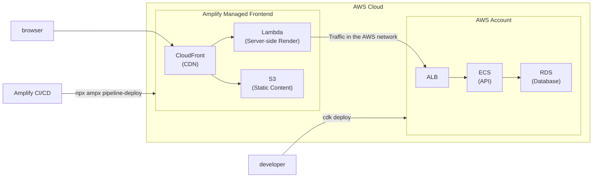

kubell Advent Calendar 2024 の投稿です。

:::message
2024年7月1日、Chatwork株式会社は株式会社kubellへと社名変更しました。
:::

https://qiita.com/advent-calendar/2024/kubell

この投稿では、BPaaS プロダクト開発において AWS Amplify Gen 2 (Amplify) を選択した理由について書きます。

## tl;dr

- Amplify を選定した理由は、開発効率とスピード向上のため
- AWS サービスとのネイティブ統合で認証やデータベース設定が簡単
- 自動ビルド・デプロイ機能により迅速な開発とリリースが可能
- 柔軟な環境管理でチームの要件に適合

## 前提

### BPaaS サービスとは

- チャット経由で会計、労務、総務など様々なバックオフィス業務をアウトソースできる「Chatwork アシスタント」などのサービスです。
- 私たちは現在バックオフィス業務管理システムの構築を進めています。

https://assistant.chatwork.com/?adcode=orgic_platf_cwassistant_gm-om_corporate&utm_source=gm-om&utm_medium=corporate&utm_campaign=cwassistant&utm_term=non&utm_content=cid25

### スキルスタック

- 私たちの共通のスキルスタックは TypeScript です。Full-Satck TypeScript がチームの方向性として合致していました。
- Amplify は AWS CDK でインフラを構築でき、TypeScript との親和性が高いです。
    - 私自身の経験としても、CDK for Terraform を使用して構築した経験があり、前職での経験が Amplify に対応しやすいものとなっていました。

### チーム状況

私たちがチームを構築したのは最近で、Developer は多くありません。そのため、効率的に開発を進める必要がありました。

## Amplify を選定した理由

### 開発効率とスピードの向上

市場志向のチームとして、開発効率とスピードの向上という明確な理由があります。Amplify は、簡単に安全でスケーラブルなアプリを構築することができます。

### プラグイン アーキテクチャの活用

- AWS の各種サービス、特に認証やデータベースとのネイティブな統合が特徴です。
- Amplify が持つこの特徴より、必要に応じて Amazon Cognito などの AWS サービスを組み合わせることができ、柔軟なシステム設計が可能です。

https://docs.amplify.aws/vue/build-a-backend/auth/set-up-auth/

### バックエンドの技術スタック選定

- バックエンドの Frameowork として NestJS を選定しました。

https://docs.nestjs.com/

- この選択により、フロントエンド・バックエンドどちらも開発することができ、メンバーの作業負荷状況に合わせて、フロントエンド・バックエンドに移動しながら開発できます。

### 自動デプロイと環境管理の柔軟性

- Amplify には default で GitHub と連携して自動的にビルドやデプロイを行う機能があり、開発チーム全体のフローを円滑にする役割を果たしています。
- 特に私たちのように素早いプロダクト リリースとフィード バックサイクルを目財しているチームにとって、Amplify の自動デプロイ機能は非常に魅力的です。
- Amplify Console の利用により、異なるブランチを異なる環境（例えば Staging や Production）に割り当てることができるため、環境ごとのテストや確認がスムーズに行えます。

## 課題

### `ampx` コマンドのエラー解析の難しさ

- `ampx` コマンドでデプロイ時に発生するエラーから原因を特定するのはその時点では難しいと感じられました。
- 一方 `cdk diff` `cdk deploy` の警告や stacktrace は多くの情報を与えてくれます。`ampx` コマンドと比較して。

### Stateful な構成要素の扱い

- Database などの Stateful な構成要素は変更が必要なタイミングが限られており、アプリケーションのデプロイサイクルとは異なります。
- 原理的にはカスタム リソースを用いれば、Database を含め Amplify で構成することも可能でした。私がサポートに確認した時点では、サポートの見解も同様でした。しかし、最終的にカスタム リソースの全面的な採用は断念しました。

https://docs.amplify.aws/react/build-a-backend/add-aws-services/custom-resources/

- Amplify で稼働している Lambda (Render) から Backend API の Endpoint である ALB への通信は、リージョン内およびリージョン間のトラフィックは AWS のネットワーク内に留まるため、必要以上の Latency は発生しない計算です。

https://docs.aws.amazon.com/ja_jp/vpc/latest/userguide/how-it-works.html#what-is-aws-global-network

---

記事は以上です。

この投稿をみていただい方はいいねをお願いします。

それでは次回のアドカレでお会いしましょう👋
