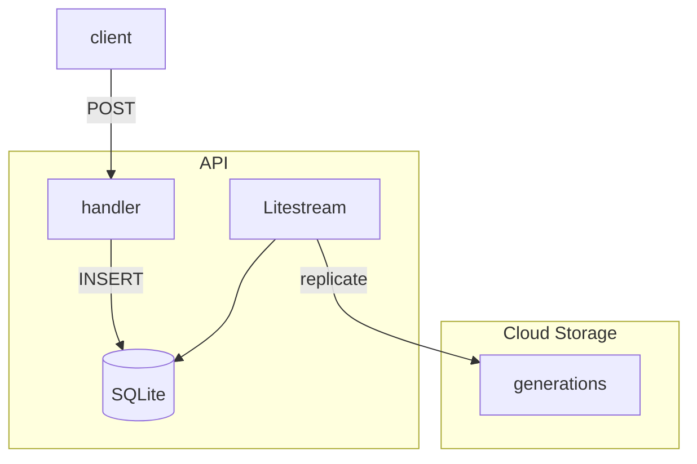

Litestream について。

https://litestream.io/

> Stop building slow, complex, fragile software systems. Safely run your application on a single server.
Fully-replicated database with no pain and little cost.
> 
> 遅くて複雑で壊れやすいソフトウェアシステムの構築はもうやめましょう。単一サーバー上でアプリケーションを安全に実行できます。
完全に複製されたデータベースを、手間もコストもかけずに利用できます。

[](https://star-history.com/#benbjohnson/litestream&Date)

Litestream[^1] は SQLite を複製してくれるツールらしい。一番近くに保持出来て永続化も出来る。

Rust の API に Litestream を組み合わせて使ってみる。

構成は次のとおり。



## Create Container
- Cloud Run の場合、PORT `8080` と HOST `0.0.0.0` に気を付ける。毎回そこで error になる。
- Rocket は `Rocket.toml` に設定を定義する。

https://github.com/danny-yamamoto/rust-api-samples-rocket/blob/3217ce35658f4e0472ef51dcc74d33b90fdb4907/rocket/Rocket.toml#L5-L7

- Litestream の binary を追加。

https://github.com/danny-yamamoto/rust-api-samples-rocket/blob/3217ce35658f4e0472ef51dcc74d33b90fdb4907/rocket/Dockerfile#L43-L44

- `litestream replicate` の background で API を起動。

https://github.com/danny-yamamoto/rust-api-samples-rocket/blob/3217ce35658f4e0472ef51dcc74d33b90fdb4907/rocket/run.sh#L7

## Deploy
- Cloud Run に deploy。

## Check the replicate
- Create method を追加する。Rocket の post[^2] は `format` `data` で Body を設定する。
```rust
#[post("/users", format = "json", data = "<user_data>")]
pub async fn user_post_handler(user_data: Json<User>, user_service: &State<Arc<UserService>>) -> (Status, (ContentType, Json<Option<User>>)) {
    let user = user_data.into_inner();
    println!("user_id: {}", user.user_id);
    match user_service.create_user(user).await {
        Ok(_) => (Status::Ok, (ContentType::JSON, Json(None))),
        Err(_) => (Status::InternalServerError, (ContentType::JSON, Json(None))),
    }
}
```

- API を実行する。

```bash
root ➜ /workspaces/rust-api-samples-rocket/rocket (main) $ curl -X POST -i -H "Content-Type: application/json" -d '{"user_id" : 5}' https://rocket-kk7z4sbvqa-an.a.run.app/userssers
HTTP/2 200 
content-type: application/json
x-frame-options: SAMEORIGIN
x-content-type-options: nosniff
permissions-policy: interest-cohort=()
x-cloud-trace-context: 65e39d11c377a9ff86e0a8b01ae5a9a0;o=1
date: Sun, 11 Feb 2024 01:35:41 GMT
server: Google Frontend
content-length: 4
alt-svc: h3=":443"; ma=2592000,h3-29=":443"; ma=2592000
root ➜ /workspaces/rust-api-samples-rocket/rocket (main) $
```

- bucket には `generations` folder が作成される。
```bash
yamamoto_daisuke@cloudshell:~ (hoge-334000)$ gsutil ls gs://litetodo/local.db/*/*
gs://litetodo/local.db/generations/3d1cedda7f76e794/:
gs://litetodo/local.db/generations/3d1cedda7f76e794/snapshots/
gs://litetodo/local.db/generations/3d1cedda7f76e794/wal/

gs://litetodo/local.db/generations/71eaf42511de8f63/:
gs://litetodo/local.db/generations/71eaf42511de8f63/snapshots/
gs://litetodo/local.db/generations/71eaf42511de8f63/wal/

gs://litetodo/local.db/generations/9240f1ff1ffe3b9d/:
gs://litetodo/local.db/generations/9240f1ff1ffe3b9d/snapshots/
gs://litetodo/local.db/generations/9240f1ff1ffe3b9d/wal/

gs://litetodo/local.db/generations/dcfb5d0db3c4b6d8/:
gs://litetodo/local.db/generations/dcfb5d0db3c4b6d8/snapshots/
gs://litetodo/local.db/generations/dcfb5d0db3c4b6d8/wal/
yamamoto_daisuke@cloudshell:~ (hoge-334000)$ 
```

コードはこちら。

https://github.com/danny-yamamoto/rust-api-samples-rocket

## BTW
花粉の季節が到来 🌲

フラクトオリゴ糖を摂取する生活を再開する。個人的に去年、効果があったので今年も継続する。

[^1]: https://litestream.io/getting-started/
[^2]: https://rocket.rs/v0.5/guide/requests/#body-data
