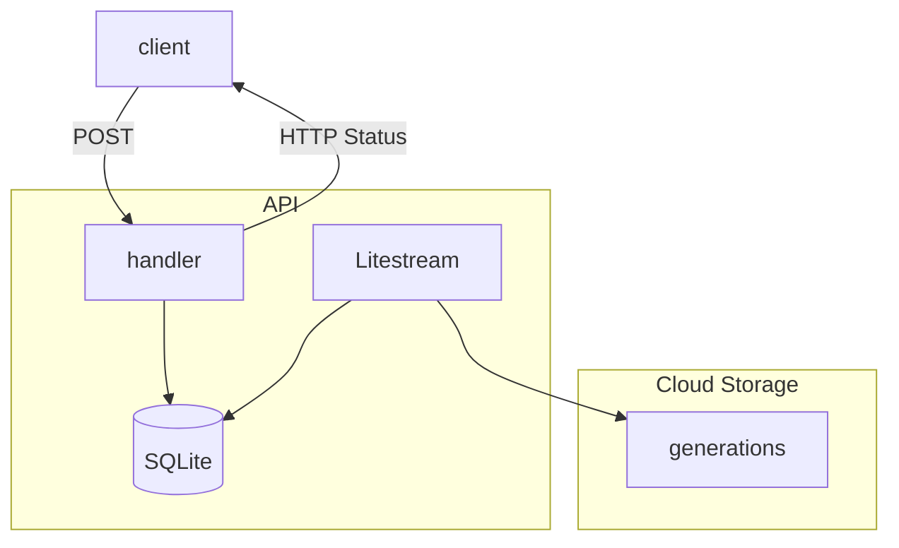

Litestream と Rust について。

https://litestream.io/

> Stop building slow, complex, fragile software systems. Safely run your application on a single server.
Fully-replicated database with no pain and little cost.
> 
> 遅くて複雑で壊れやすいソフトウェアシステムの構築はもうやめましょう。単一サーバー上でアプリケーションを安全に実行できます。
完全に複製されたデータベースを、手間もコストもかけずに利用できます。

Litestream は SQLite を複製してくれるツール。

以前 Rust と SQLite で API を作成した。この API に Litestream を組み合わせて使ってみる。

構成は次のとおり。🍝

## Create Container
- Cloud Run の場合、PORT `8080` と HOST `0.0.0.0` に気を付ける。毎回そこで error になる。
- Litestream の binary を追加。
- `litestream replicate` の background で API を起動。

## Deploy
- Cloud Run に deploy する。

## Check the replicate
- Create method を追加する。

- API を実行する。
- bucket には generations folder が作成される。
