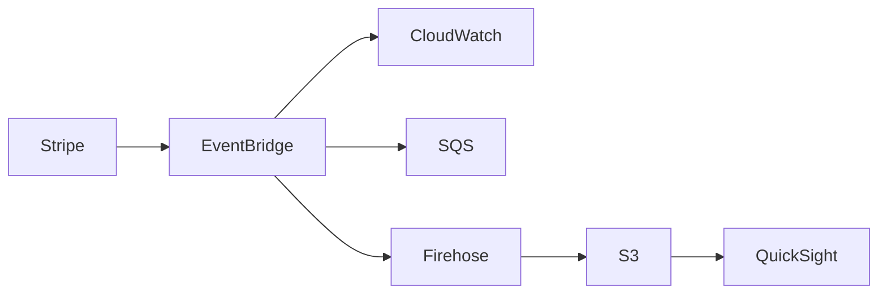

Stripe の決済情報を reporting に活用する事例を紹介します。

Stripe は接続の容易さと柔軟性が魅力的だと思います。

今回、BPaaS プロダクトの決済情報を Stripe で管理し、その情報を reporting に活用する事例を紹介します。

EventBridge を使用して Stripe のイベントを受け取ります。

受け取ったイベントを target に送信することで、イベントを処理します。

CloudWatch Logs、Amazon SQS、Amazon Firehose を target として使用できます。

SQS を使用する場合、イベントをキューに送信して、後で処理できます。

Firehose を使用する場合、イベントを S3 に保存できます。

S3 に保存されたイベントをレポートとして使用できます。

S3 に保存されたイベントを QuickSight などの BI で可視化することもできます。
