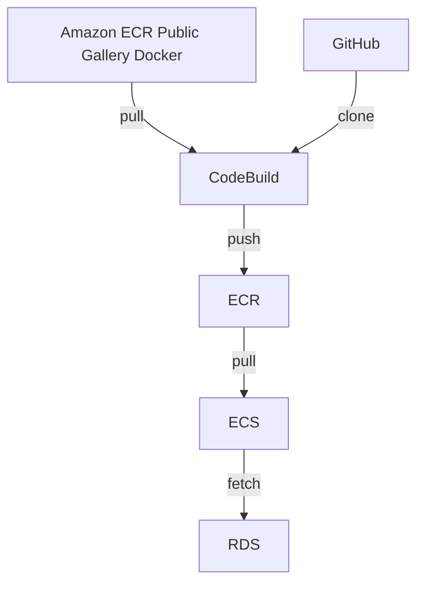

Amazon Elastic Container Service (ECS) [^1] について。

前職で使用していた Google Cloud のサービスと関連付けながら学ぶ。

ECS はほとんど触ったことがなかった。

ECS の設定周りと RDS へのの接続について学ぶ。



## tl;dr
- Rust の App を ECS Fargate で動かした。
- AWS を利用する上では「セキュリティ グループ」が重要だと思う。サービス間の inbound/outbound を正しく理解すること。
- 「セキュリティ グループ」は Google Cloud の Firewall と同じ位置付けになると思う。それと IAM が必要。

## About CodeBuild

- Cloud Build に似たサービス。
- `buildspec.yml` を定義。Cloud Build のビルド構成ファイル [^6] のような。

https://github.com/danny-yamamoto/rust-api-samples-axum/blob/main/buildspec.yml

|Item|Google Cloud|AWS|note|
|----|----|----|----|
|Build の定義|yaml|yaml|GitHub で管理|
|Docker の代替|`mirror.gcr.io`|`Amazon ECR Public Gallery Docker` [^3]||
|環境変数|デフォルトとユーザー定義 [^4]|デフォルトとユーザー定義 [^5]||
|権限と権限の付与|基本的に Default Google Service Account に権限を付与|IAM||

### Point 💡
- DockerHub の rate limit [^2] に引っかかるため、 `Amazon ECR Public Gallery Docker` [^3] に変更。

https://github.com/danny-yamamoto/rust-api-samples-axum/blob/30cf65f6922bf813bb2b4855a19731d839ea6177/Dockerfile#L2-L3

https://github.com/danny-yamamoto/rust-api-samples-axum/blob/30cf65f6922bf813bb2b4855a19731d839ea6177/Dockerfile#L32-L33

## About Amazon Elastic Container Registry (ECR)

- Artifact Registry に似たサービス。

## About ECS

- Cloud Run に似たサービス。
- 「タスク」と「サービス」への理解が必要。

```bash
yamamotodaisuke@yamamotodaisukenoMacBook-Air zenn-docs % curl -i 44.x.x.x                              
HTTP/1.1 200 OK
content-type: application/json
content-length: 31
date: Wed, 27 Mar 2024 02:36:35 GMT

[{"user_id":1},{"user_id":999}]%                                                                                                                                                      
yamamotodaisuke@yamamotodaisukenoMacBook-Air zenn-docs %
```


### Point 💡
- セキュリティグループの設定:
    - ECS Fargate タスクのセキュリティ グループと RDS インスタンスのセキュリティ グループにお互いの通信を許可するルールを追加します。
    - 具体的には以下を許可する inbound/outbound ルールを追加します。
        - `タイプ`: PostgreSQL
        - `プロトコル`: TCP
        - `ポート範囲`: 5432

## BTW
もうすぐで有給消化期間が終わる

起床して running。カフェで programming しつつ、夕食作りや洗濯、掃除、塾の送迎をする毎日

社会性の動物であることを認識した

仕事が無いと人との関わりが薄れている状態

より大事にするべきことは何かを考えさせられた

まさに「人生後半の戦略書」のとおり

https://www.sbcr.jp/product/4815618476/

[^1]: https://aws.amazon.com/jp/ecs/
[^2]: https://docs.docker.com/docker-hub/download-rate-limit/
[^3]: https://gallery.ecr.aws/docker
[^4]: https://cloud.google.com/build/docs/configuring-builds/substitute-variable-values?hl=ja
[^5]: https://docs.aws.amazon.com/ja_jp/AmazonECS/latest/developerguide/taskdef-envfiles.html
[^6]: https://cloud.google.com/build/docs/configuring-builds/create-basic-configuration?hl=ja
