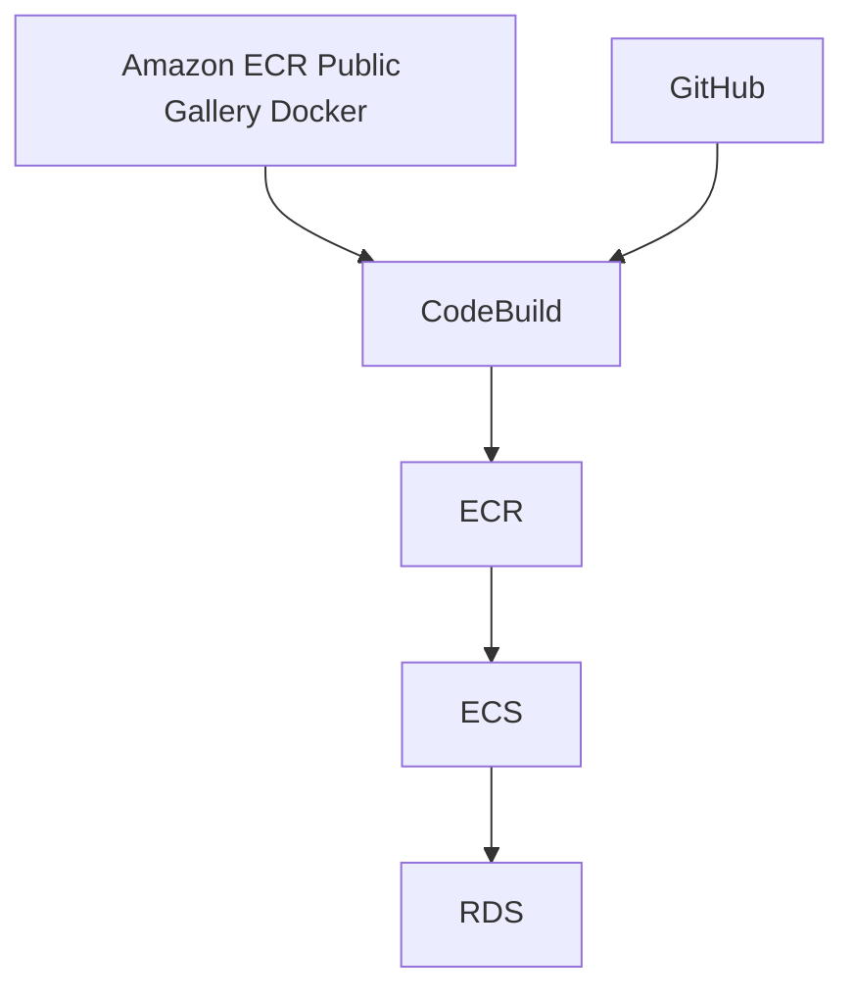

Amazon Elastic Container Service (Amazon ECS) [^1] について。

前職で使用していた Google Cloud のサービスと関連付けながら学ぶ。

ECS はほとんど触ったことがない。

ECS の設定周りと RDS へのの接続について学ぶ。

## About CodeBuild
- Cloud Build に似たサービス。
- さっそく DockerHub の rate limit [^2] に引っかかった。`Amazon ECR Public Gallery Docker` [^3] に変更した。

|Item|Google Cloud|AWS|note|
|----|----|----|----|
|Build の定義|yaml|yaml|ファイル名に決まりは無い。|
|Docker の代替|`mirror.gcr.io`|`Amazon ECR Public Gallery Docker`||
|環境変数|デフォルトとユーザー定義 [^4]|デフォルトとユーザー定義||
|権限と権限の付与|基本的に Default Google Service Account に権限を付与|||

## About Amazon Elastic Container Registry (ECR)

## About ECS
- Cloud Run に近いサービス。

[^1]: https://aws.amazon.com/jp/ecs/
[^2]: https://docs.docker.com/docker-hub/download-rate-limit/
[^3]: https://gallery.ecr.aws/docker
[^4]: https://cloud.google.com/build/docs/configuring-builds/substitute-variable-values?hl=ja
