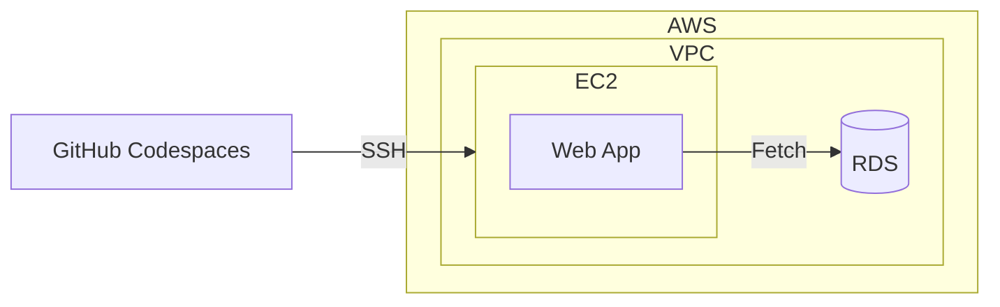

Amazon Relational Database Service (RDS) [^4] について。



前職で使用していた Google Cloud のサービスと関連付けながら学ぶ。

構築済みの RDS を触ったことはあったが、設定周りは詳しくない。

RDS の設定周りと Application からの接続について学び直す。

## About RDS
- Cloud SQL と似たサービス。
- EC2/RDS、GCE/Cloud SQL を比較すると、つなぎ方自体に違和感は感じない。
- Database Parameter の変更方法が異なると感じた。今回は SSL 接続を変更した。[^3]

|Item|Cloud SQL|RDS|Note|
|----|----|----|----|
|Database Parameter|データベース フラグを変更する [^1]|`DB パラメータグループ` を作成する [^2]||
|Host Name|`Private IP` or `Serverless VPC Access Connector` or `Direct VPC egress`|`Private Endopoint` or `VPC Connector`|

## Using RDBMS from my application
- App 観点での違いはほぼ無い。
- EC2 から RDS への接続を試した。
- Rust で簡単な Web App を実装した。`Axum` と `tokio-postgres` を使用。

## Local
### Create database
```bash
sudo apt-get update
sudo apt-get install -y postgresql-client

PGPASSWORD=postgres psql -h db -p  5432 -U postgres -d postgres
psql -h db -p  5432 -U postgres -d postgres
```

```sql
CREATE TABLE IF NOT EXISTS users ( user_id INTEGER PRIMARY KEY, email_address TEXT, created_at INTEGER, deleted INTEGER, settings TEXT);
INSERT INTO users (user_id, email_address, created_at, deleted, settings) VALUES (1, 'maria@example.com', 0, 0, '');
INSERT INTO users (user_id, email_address, created_at, deleted, settings) VALUES (999, 'admin@example.com', 0, 0, '');
```

### Set environment variables
```bash
export DB_HOST="db"
export DB_PASSWORD="postgres"
echo $DB_HOST
echo $DB_PASSWORD
```

### Run app
```bash
cargo run
```

```bash:log
@danny-yamamoto ➜ /workspaces/rust-api-samples-axum (feature/add-ec2-to-readme) $ cargo run
   Compiling rust-api-samples-axum v0.1.0 (/workspaces/rust-api-samples-axum)
    Finished dev [unoptimized + debuginfo] target(s) in 14.38s
     Running `target/debug/rust-api-samples-axum`
```

```bash:log
@danny-yamamoto ➜ /workspaces/rust-api-samples-axum (feature/add-ec2-to-readme) $ curl -i localhost:3000
HTTP/1.1 200 OK
content-type: application/json
content-length: 31
date: Fri, 22 Mar 2024 06:27:50 GMT

[{"user_id":1},{"user_id":999}]
@danny-yamamoto ➜ /workspaces/rust-api-samples-axum (feature/add-ec2-to-readme) $
```

## AWS
### SSH
```bash
ssh -i local.pem ec2-user@ec2-x-x-x-x.compute-1.amazonaws.com
```

### Create database
```bash
sudo dnf update -y
sudo dnf install postgresql15

psql --host=database-test1.hogehoge.us-east-1.rds.amazonaws.com --port=5432 --dbname=postgres --username=postgres
```

```bash: log
@danny-yamamoto ➜ /workspaces/rust-api-samples-axum (main) $ ssh -i local.pem ec2-user@ec2-x-x-x-x.compute-1.amazonaws.com
   ,     #_
   ~\_  ####_        Amazon Linux 2023
  ~~  \_#####\
  ~~     \###|
  ~~       \#/ ___   https://aws.amazon.com/linux/amazon-linux-2023
   ~~       V~' '->
    ~~~         /
      ~~._.   _/
         _/ _/
       _/m/'
Last login: Fri Mar 22 00:45:47 2024 from x.x.x.x
[ec2-user@ip-z-z-z-z ~]$ psql --host=database-test1.hogehoge.us-east-1.rds.amazonaws.com --port=5432 --dbname=postgres --username=postgres
Password for user postgres: 
[ec2-user@ip-z-z-z-z ~]$ 
[ec2-user@ip-z-z-z-z ~]$ psql --host=database-test1.hogehoge.us-east-1.rds.amazonaws.com --port=5432 --dbname=postgres --username=postgres
Password for user postgres: 
psql (15.6, server 16.1)
WARNING: psql major version 15, server major version 16.
         Some psql features might not work.
SSL connection (protocol: TLSv1.3, cipher: TLS_AES_256_GCM_SHA384, compression: off)
Type "help" for help.

postgres=> 
postgres=> 
postgres=> CREATE TABLE IF NOT EXISTS users ( user_id INTEGER PRIMARY KEY, email_address TEXT, created_at INTEGER, deleted INTEGER, settings TEXT);
CREATE TABLE
postgres=> INSERT INTO users (user_id, email_address, created_at, deleted, settings) VALUES (1, 'maria@example.com', 0, 0, '');
INSERT 0 1
postgres=> INSERT INTO users (user_id, email_address, created_at, deleted, settings) VALUES (999, 'admin@example.com', 0, 0, '');
INSERT 0 1
postgres=> select * from users;
 user_id |   email_address   | created_at | deleted | settings 
---------+-------------------+------------+---------+----------
       1 | maria@example.com |          0 |       0 | 
     999 | admin@example.com |          0 |       0 | 
(2 rows)

postgres=> \q
[ec2-user@ip-z-z-z-z ~]$
```

### Deploy app
```bash
scp -i /workspaces/rust-api-samples-axum/local.pem /workspaces/rust-api-samples-axum/release ec2-user@ec2-x-x-x-x.compute-1.amazonaws.com:/home/ec2-user/release
```

### Set environment variables
```bash
export DB_HOST="xxxx"       # Endpoint
export DB_PASSWORD="zzzz"   # Auto generated password
echo $DB_HOST
echo $DB_PASSWORD
```

### Run app
```bash
[ec2-user@ip-z-z-z-z ~]$ ./release &
[1] 41692
[ec2-user@ip-z-z-z-z ~]$ curl -i localhost:3000
HTTP/1.1 200 OK
content-type: application/json
content-length: 31
date: Fri, 22 Mar 2024 06:34:11 GMT

[{"user_id":1},{"user_id":999}]
[ec2-user@ip-z-z-z-z ~]$ 
```

## BTW


有休消化中は、3 時間は外で過ごすことにした。気分転換のため。

近所の AEON のフードコートで、読書と Programming。電源が無いのが辛い 😞

[^1]: https://cloud.google.com/sql/docs/postgres/flags?hl=ja#set_a_database_flag
[^2]: https://docs.aws.amazon.com/ja_jp/AmazonRDS/latest/UserGuide/USER_WorkingWithDBInstanceParamGroups.html
[^3]: https://docs.aws.amazon.com/ja_jp/AmazonRDS/latest/UserGuide/PostgreSQL.Concepts.General.SSL.html
[^4]: https://aws.amazon.com/jp/rds/
