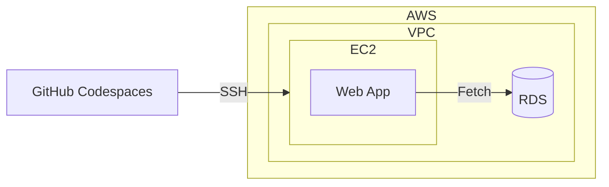

Amazon Relational Database Service (RDS) [^4] について。

前職で使用していた Google Cloud のサービスと関連付けながら学ぶ。

構築済みの RDS を触ったことはあったが、設定周りは詳しくない。

RDS の設定周りと Application からの接続について学び直す。

## About RDS
- Cloud SQL と似たサービス。
- EC2/RDS、GCE/Cloud SQL を比較すると、つなぎ方自体に違和感は感じない。
- Database Parameter の変更方法が異なると感じた。今回は SSL 接続を変更した。[^3]

|Item|Cloud SQL|RDS|Note|
|----|----|----|----|
|Database Parameter|データベース フラグを変更する [^1]|`DB パラメータグループ` を作成する [^2]||
|Host Name|`Private IP` or `Serverless VPC Access Connector` or `Direct VPC egress`|`Private Endopoint` or `VPC Connector`|

## Using RDBMS from my application
- App 観点での違いはほぼ無い。
- EC2 から RDS への接続を試した。
- Rust で簡単な Web App を実装した。`Axum` と `tokio-postgres` を使用。

## BTW
有休消化中は、3 時間は外で過ごすことにした。気分転換のため。

近所の AEON のフードコートで、読書と Programming。そこは電源が無いのが辛い。

[^1]: https://cloud.google.com/sql/docs/postgres/flags?hl=ja#set_a_database_flag
[^2]: https://docs.aws.amazon.com/ja_jp/AmazonRDS/latest/UserGuide/USER_WorkingWithDBInstanceParamGroups.html
[^3]: https://docs.aws.amazon.com/ja_jp/AmazonRDS/latest/UserGuide/PostgreSQL.Concepts.General.SSL.html
[^4]: https://aws.amazon.com/jp/rds/
