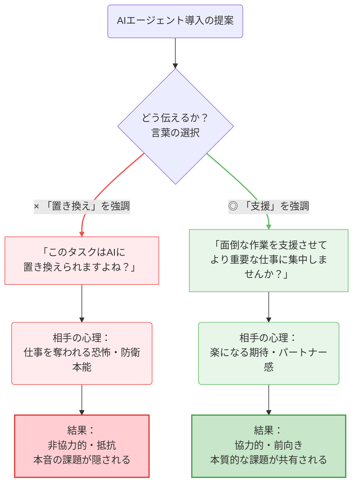
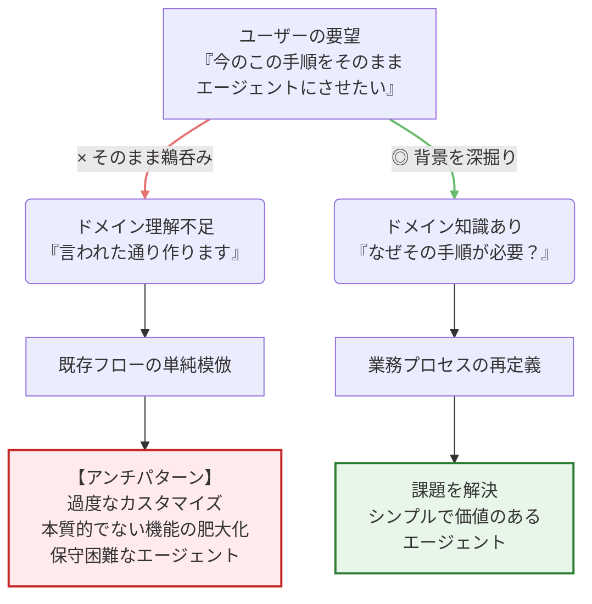
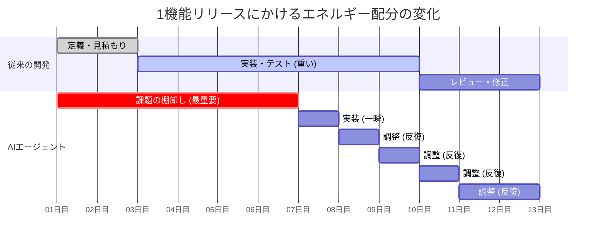
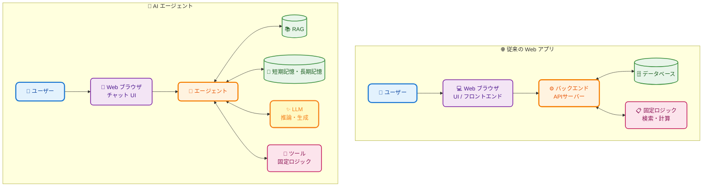

「BPaaS/AI+BPO Advent Calendar 2025」の投稿です。

[https://adventar.org/calendars/11348:embed:cite]

プロダクト戦略ユニットの山本です。

## はじめに

AI エージェントを業務に導入する際、技術的な課題よりも人とのコミュニケーションが障壁になることがあります。今回はそのポイントについてお話しします。

<!-- more -->

## TL;DR

- AI エージェントを業務に取り入れる際は、コミュニケーション方法が成否を分けます。仕事の「置き換え」という言葉は心理的抵抗を生むため避け、ヒアリングは鵜呑みにせずドメイン理解を深めることが重要です。
- 開発ハードルは劇的に下がっています。Chat インターフェースを用いた AI エージェントの実体は Web アプリケーションに LLM の概念が加わったものであり、基本的にはコモディティ化された Web 開発の知見が活かせます。
- 技術的な難易度よりも、ビジネス課題の棚卸しと、その解決に向けた「人」との向き合い方が成功の鍵となります。

[:contents]

## AI エージェントを業務に取り入れる際に大切なコミュニケーション

AI エージェント（以下、エージェント）を業務に取り入れる際には、「どのような話し方で進めるか」が非常に重要だと思います。 例えば、ある業務タスクについて「それはエージェントに置き換えることができますよね」といった言い方をすると、良い反応が得られないことがあります。 これは、「あなたの仕事はエージェントで置き換え可能ですよね」と言われているように受け取られてしまうからではないかと推測しています。

確かに、自分の業務について「置き換えられますよね？」と問われると、防衛的になったり、「100%置き換えるのは難しい」という反論をしたくなるものです。これは心理的な反応だと思います。

## ヒアリングの落とし穴

また、エージェントの導入に向けてヒアリングを行う際にも注意点があると考えています。それは、「全てを鵜呑みにしないこと」です。

顧客との要件定義を経験された方であればご理解いただけると思いますが、ドメイン知識が不足した状態で聞き取った要望をそのまま実装すると、本質的でない要求まで取り込んでしまうことがあります。
ヒアリングだけに頼ると常に後手に回り、最適なエージェント導入にはつながりません。

これは私が医療パッケージソフトを病院に導入していたときの経験とも同じです。顧客と同等以上のドメイン理解を持たずに導入を進めると、不要な機能追加や過度なカスタマイズにつながる「アンチパターン」に陥りがちです。

## 工数見積もりよりも「課題の棚卸し」が重要

さらに、開発工数の見積もりでも注意点があります。エージェントの開発は多くの場合、新規開発になります。既存の複雑な依存関係がなく、ゼロベースで開発できるため、**開発そのものは高速に行えます**。Coding Assistant をフル活用できます。

そのため、注意すべきは開発工数ではなく、**ビジネス上の課題を多く集めること**です。

「Google Drive からですか？」「メール添付ですか？」といった情報の受け渡し方法の違い等は、エージェント導入において大きな壁にはなりません。

## 基本は Web アプリケーションと変わらない

技術的な側面でもう一つお伝えしたいのは、**基本的にはこれまでの Web アプリケーションと変わらない**ということです。

「AI」や「LLM」という言葉が入ると、ことさら難しいことに取り組むと勘違いされがちです。しかし、エージェントとして Web インターフェースを介して機能を提供する場合、基本的には既存の Web アプリケーションの仕組みを使えます。

そう考えると、すでにコモディティ化された Web アプリケーション開発の知見があれば、あとは「LLM」という一部追加された概念に向き合えばいいだけです。そこに特大の違いはありません。

シンプルに **「LLM とは何か？」「何が出来て何が出来ないのか」** ということに対し、地道に向き合い知識を蓄える。それだけで答えは出るはずですし、決して恐れるような未知の技術ではないです。

## まとめ

まとめると、要件定義やヒアリングといったプロセスは従来のプロダクト開発と同様ですが、ご存知のとおり**開発のハードルは劇的に下がっています**。エージェントの業務導入において、技術的な実装よりも重要なのは「人」との向き合い方だと思います。

現状、エージェントは業務を「奪う」ものではなく、業務担当者がより創造的で価値の高い仕事に集中できるよう「支援する」ものです。この視点を持つことが、エージェント導入成功への第一歩だと考えます。

---

記事は以上です。

今後も エージェントに関する発信する予定です。BPaaS 戦略に興味をお持ちでしたら、ぜひお気軽にお問い合わせください。

この投稿をみていただい方はいいねをお願いします。

それでは次回のアドカレでお会いしましょう👋
