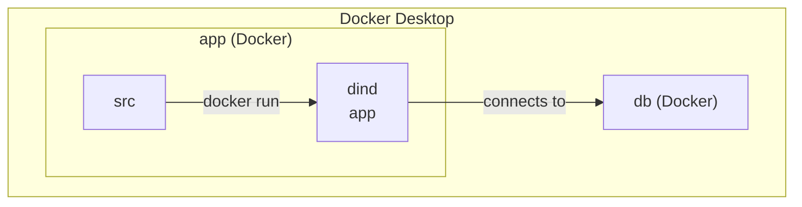

Docker について。

Docker-in-Docker ( dind ) の container 内から Host への接続について残す。毎回、何だっけ？となるため。

泥水をすするような仕事を繰り返すのは避けたい。



## tl;dr
- `--network="host"` コンテナ内でホスト側ネットワーク・スタックを使用する。 [^1]

## Create a dind
```bash
# example
docker run --name mysql-container-4 --network="host" -e MYSQL_ROOT_PASSWORD=rootpassword -d mysql:latest
```

## Connect from app to db
```bash
docker exec -it mysql-container-4 bash
mysql -h db -u mysql -p
```

```bash
node ➜ /workspaces/kbp-bpaas-fdby-1/api (main) $ docker exec -it mysql-container-4 bash
bash-5.1# mysql -h db -u mysql -p
Enter password: 
Welcome to the MySQL monitor.  Commands end with ; or \g.
Your MySQL connection id is 19
Server version: 8.4.0 MySQL Community Server - GPL

Copyright (c) 2000, 2024, Oracle and/or its affiliates.

Oracle is a registered trademark of Oracle Corporation and/or its
affiliates. Other names may be trademarks of their respective
owners.

Type 'help;' or '\h' for help. Type '\c' to clear the current input statement.

mysql> USE mysql-db;
Reading table information for completion of table and column names
You can turn off this feature to get a quicker startup with -A

Database changed
mysql> SELECT * FROM users;
+----+----------+------------------+
| id | name     | email            |
+----+----------+------------------+
|  1 | John Doe | john@example.com |
+----+----------+------------------+
1 row in set (0.00 sec)

mysql>
```

## Conclusion
アドラーの言葉

https://d21.co.jp/book/detail/978-4-7993-3010-4

「課題の分離」は有名で、要するに自分に集中すること。

一方で、「課題の分離」で解決できない問題もあります。例えば、親子。

私は、これは子供を持ち改めて実感した。勉強してほしい。時間を守ってほしい。片付けをしてほしい。

どれも子供の課題です。しかし、「好きにしろ」と突き放したところで、一緒に生活する以上考えないことは不可能です。

これを「共同の課題」と捉えて、どうしたら解決できるかを話し合いするめることが必要になる。

「勉強しろ」「片付けろ」と一方的に一方的に指示する事は、子供の課題に土足で踏み込むことになる。

これはチーム開発にも言えることで、共同の課題として提案するスタンスが重要。

お互いのベースラインを合わせること。

そして、課題感を伝えること。

本全般は、技術書だけでは得られない社会で生きていくために必要なものを与えてくれる。

「速く学び、 変わり続けよう」


[^1]: https://docs.docker.jp/v1.11/engine/reference/run.html#network-settings
