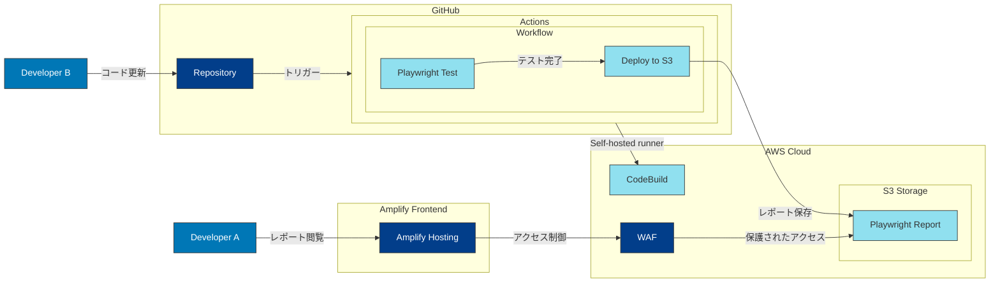

## tl;dr

- GitHub Actions の Self-hosted runner を使用して E2E テストを自動化
- Playwright Report を S3 にデプロイし、Amplify Hosting で配信
- GitHub Actions の OIDC を利用して安全な AWS リソースへのアクセス
- Amplify Hosting の WAF 統合により、テスト結果の安全な共有

## 前提

本記事では、BPaaS の E2E テストの自動化から結果の可視化までの実装について紹介します。特に以下の技術スタックを使用した実装方法に焦点を当てています：

- GitHub Actions (Self-hosted runner)
- Playwright
- AWS Amplify Hosting
- Amazon S3
- AWS WAF

### BPaaS サービスとは

- チャット経由で会計、労務、総務など様々なバックオフィス業務をアウトソースできる「Chatwork アシスタント」などのサービスです。
- 私たちは現在バックオフィス業務管理システムの構築を進めています。

## E2E テストの自動化

### Self-hosted runner の活用

https://docs.aws.amazon.com/ja_jp/codebuild/latest/userguide/action-runner-questions.html

Self-hosted runner を使用することで、以下のメリットが得られました：

- プライベート ネットワーク内でのテスト実行が可能。
- コスト管理の一元化。

テスト実行時の認証については、Okta/Auth0 を使用した認証が課題となりました。この課題に対して、以下のアプローチを採用しました：

- 開発用の起動モードを使用。このモードでは、認証をスキップしテストユーザーを使用します。
- GitHub Actions 内でアプリの起動。

### OIDC による安全なAWSリソースアクセス

https://docs.github.com/ja/actions/security-for-github-actions/security-hardening-your-deployments/configuring-openid-connect-in-amazon-web-services

GitHub Actions から AWS リソースへのアクセスには、認証情報を保存することなく、安全なアクセスが可能にするため、OIDC（OpenID Connect）を使用しました。

以下のようなカスタム信頼性ポリシーを作成しました：

https://docs.github.com/ja/actions/security-for-github-actions/security-hardening-your-deployments/configuring-openid-connect-in-amazon-web-services

```json
{
    "Version": "2012-10-17",
    "Statement": [
        {
            "Effect": "Allow",
            "Principal": {
                "Federated": "arn:aws:iam::ACCOUNT-ID:oidc-provider/token.actions.githubusercontent.com"
            },
            "Action": "sts:AssumeRoleWithWebIdentity",
            "Condition": {
                "StringLike": {
                    "token.actions.githubusercontent.com:sub": "repo:organization/repository:*"
                }
            }
        }
    ]
}
```

## テスト結果の可視化

### Playwright Report の活用

https://playwright.dev/docs/test-reporters#html-reporter

Playwright では、HTML レポーターを使用することで、詳細なテスト結果を生成することが可能です。`playwright.config.ts` に設定を追加しました：

```typescript
// playwright.config.ts
export default defineConfig({
  reporter: [
    ['html', { outputFolder: 'playwright-report' }]
  ],
});
```

### Amplify Hosting による配信

https://aws.amazon.com/jp/blogs/news/simplify-and-enhance-amazon-s3-static-website-hosting-with-aws-amplify/

生成したレポートは、S3 にアップロードし、Amplify Hosting を使用して配信します。Amplify Hosting は S3 とのシームレスな統合が可能です：

- デプロイフローを簡素化
- CDN による配信
- カスタムドメインの設定が容易

```yaml
- name: Deploy to S3
  run: |
    aws s3 sync playwright-report/ s3://your-bucket-name/
```

### セキュリティ対策

現在プレビュー段階ではありますが、Amplify Hosting の WAF 統合を使用することで、以下のようなセキュリティ対策が可能です：

https://docs.aws.amazon.com/amplify/latest/userguide/WAF-integration.html

## まとめ

これらの組み合わせにより、セキュアな E2E テスト環境を構築することができました。
