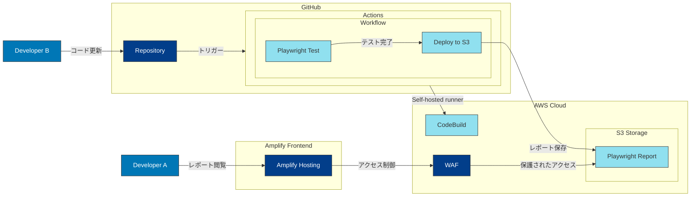

本記事では、私たちが取り組んでいる BPaaS プロダクト開発において、E2E テストの自動化から結果の可視化までをどのように実装したのか、詳しく紹介します。


## tl;dr

- GitHub Actions の Self-hosted runner を使用して E2E テストを自動化。
- Playwright Report を S3 にデプロイし、Amplify Hosting で配信。
- GitHub Actions の OIDC を利用して安全な AWS リソースへアクセス。
- Amplify Hosting の WAF 統合により、テスト結果の安全な共有。

## BPaaS プロダクトとその特徴

私たちは、E2E テストの自動化と可視化に取り組みました。この取り組みには 3 つの重要な目的があります。

- 開発業務プロセスの品質保証を効率化。自動化によって、手作業でのテスト実行にかかる時間と労力を削減できます。
- チーム全体でテスト結果を共有し、早期の問題発見を可能にする。メンバー全員がリアルタイムに近い状態でテスト状況を確認できます。
- セキュアなネットワーク環境でのテスト実行と結果共有の両立。

### BPaaS とは

[https://assistant.chatwork.com/?adcode=orgic_platf_cwassistant_gm-om_corporate&utm_source=gm-om&utm_medium=corporate&utm_campaign=cwassistant&utm_term=non&utm_content=cid25:embed:cite]

- チャット経由で会計、労務、総務など様々なバックオフィス業務をアウトソースできる「Chatwork アシスタント」などのサービスです。
- 私たちは現在バックオフィス業務管理システムの構築を進めています。

### E2E テストとその重要性

現在開発中のバックオフィス業務管理システムでは、E2E テストが特に重要だと考えます。その理由は以下のとおりです。：

- 複数の業務プロセスの連携が正しく機能することの確認。
- リグレッション（機能後退）の早期発見。新機能の追加や既存機能の修正による予期せぬ影響を、本番環境に影響を与えることなく事前に検出することができます。

## システム全体像

特に以下の技術スタックを使用した実装方法に焦点を当てています：

- GitHub Actions (Self-hosted runner)
- Playwright
- AWS Amplify Hosting
- Amazon S3
- AWS WAF



システムフロー

1. 開発者がコードを更新し、リポジトリにプッシュします。
1. GitHub Actions のワークフローが起動します。
1. Self-hosted runner 上で Playwright テストを実行します。
1. テスト結果を S3 に保存します。
1. 開発者が Amplify Hosting 経由でレポートにアクセスします。
1. WAF によるアクセス制御で、認証済みユーザーのみがレポートを閲覧可能になります。

## E2E テストの自動化

開発サイクルごとのマニュアル テストをどのように自動化するか。私たちは GitHub Actions のSelf-hosted runner と Playwright、そして AWS のマネージド サービスを組み合わせることで、この課題に取り組みました。

### Self-hosted runner の活用

https://docs.aws.amazon.com/ja_jp/codebuild/latest/userguide/action-runner-questions.html

Self-hosted runner を使用することで、以下のメリットが得られました：

- プライベート ネットワーク内でのテスト実行が可能。
- コスト管理の一元化。

テスト実行時の認証については、Okta/Auth0 を使用した認証が課題となりました。この課題に対して、以下のアプローチを採用しました：

- 開発用の起動モードを使用する。このモードでは、認証をスキップしテストユーザーを使用します。
- GitHub Actions 内でアプリの起動。

### OIDC による安全な AWS リソースアクセス

https://docs.github.com/ja/actions/security-for-github-actions/security-hardening-your-deployments/configuring-openid-connect-in-amazon-web-services

GitHub Actions から AWS リソースへのアクセスには、認証情報を保存することなく、安全なアクセスを可能にするため、OIDC（OpenID Connect）を使用しました。

https://docs.github.com/ja/actions/security-for-github-actions/security-hardening-your-deployments/configuring-openid-connect-in-amazon-web-services

以下のようなカスタム信頼性ポリシーを作成しました：

```json
{
    "Version": "2012-10-17",
    "Statement": [
        {
            "Effect": "Allow",
            "Principal": {
                "Federated": "arn:aws:iam::my-account:oidc-provider/token.actions.githubusercontent.com"
            },
            "Action": "sts:AssumeRoleWithWebIdentity",
            "Condition": {
                "StringEquals": {
                    "token.actions.githubusercontent.com:aud": "sts.amazonaws.com"
                },
                "StringLike": {
                    "token.actions.githubusercontent.com:sub": "repo:my-org/my-repo:*"
                }
            }
        }
    ]
}
```

## テスト結果の可視化

E2E テストの結果を「誰でも簡単に確認できる」かつ「安全に管理できる」形で共有することは、チームの開発効率を大きく左右すると思います。この課題に対し、私たちは Playwright Report と AWS Amplify Hosting を組み合わせたソリューションを実装しました。

### Playwright Report の活用

https://playwright.dev/docs/test-reporters#html-reporter

Playwright では、HTML レポーターを使用することで、詳細なテスト結果を生成することが可能です。`playwright.config.ts` に設定を追加しました：

```typescript
// playwright.config.ts
  reporter: [
    ['list'],
    ['html', { outputFolder: 'test-results', open: 'never' }],
  ],
```

### Amplify Hosting による配信

https://aws.amazon.com/jp/blogs/news/simplify-and-enhance-amazon-s3-static-website-hosting-with-aws-amplify/

生成したレポートは、S3 にアップロードし、Amplify Hosting を使用して配信します。Amplify Hosting は S3 とのシームレスな統合が可能です。

これにより以下を実現しました。：

- デプロイ フローを簡素化。
- CDN による配信 

S3 に保存したレポートを Amplify Hosting で配信する実装は以下の通りです：

```yaml
      - name: Setup AWS CLI
        uses: aws-actions/configure-aws-credentials@v4
        with:
          role-to-assume:
            arn:aws:iam::${{ vars.AWS_ACCOUNT_ID }}:role/github_oidc
          aws-region: ap-northeast-1
      - name: Check S3 objects
        run: aws s3 ls ${{ vars.PLAYWRIGHT_HTML_OUTPUT_S3_URI }}
      - name: Deploy S3
        run: |
          aws s3 sync ${{ vars.PLAYWRIGHT_OUTPUT_DIR }} ${{ vars.PLAYWRIGHT_HTML_OUTPUT_S3_URI }} --exact-timestamps --delete
```

### セキュリティ対策

現在プレビュー段階ではありますが、Amplify Hosting の WAF 統合を使用することで、以下のようなセキュリティ対策が可能です：

- アクセス制御
   - 社内 IP からのアクセスのみ許可。
   - 認証済みユーザーのみアクセス可能。

https://docs.aws.amazon.com/amplify/latest/userguide/WAF-integration.html

## まとめと今後の展望

これらの実装により、セキュリティの高い E2E テスト環境を構築することができました。

今後の展望は、必要に応じてテストシナリオを拡充し、テスト結果の可視化をさらに充実させて行くことです。
