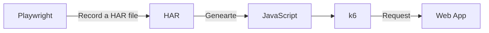

負荷試験について。

現職の開発のローンチに向けた作業が本格化している。

Production の構成の決定やコストの試算、脆弱性試験などを進めていく必要がある。

負荷試験は実際の環境に近い状態で行いたい。これまでの経験を踏まえ。

## tl;dr

- har-to-k6 [^1] は Playwright のテスト シナリオを再利用できる。
- k6 [^2] で実装するテストシナリオを削減できる。



## HAR の生成

- har ( HTTP Archiveフォーマット ) [^3] を生成するには、Context を設定。
- `context` を Close すると、har が `path` に作成される。

```typescript
    const browser = await chromium.launch(); // Or 'chromium' or 'webkit'.
    const context = await browser.newContext({
      recordHar: {
        content: 'embed',
        mode: 'full',
        path: 'dist/requests.har',
      },
    });

    // テストを書く

    // Close
    await context.close();
```

## k6 用 JavaScript の生成

- har を元に k6 用の JavaScript を生成。

```bash
root ➜ /workspaces/test-project/load-testing (main) $ npx har-to-k6 ../hoge/dist/requests.har -o test.js
info: Converting '../hoge/dist/requests.har'
info: Wrote k6 script to 'test.js'
root ➜ /workspaces/test-project/load-testing (main) $ 
```

## 実行

- k6 の通常のコマンドと同じ。

```bash
root ➜ /workspaces/test-project/load-testing (main) $ k6 run --vus 10 --duration 10s test.js 

          /\      |‾‾| /‾‾/   /‾‾/   
     /\  /  \     |  |/  /   /  /    
    /  \/    \    |     (   /   ‾‾\  
   /          \   |  |\  \ |  (‾)  | 
  / __________ \  |__| \__\ \_____/ .io

     execution: local
        script: test.js
        output: -

     scenarios: (100.00%) 1 scenario, 10 max VUs, 40s max duration (incl. graceful stop):
              * default: 10 looping VUs for 10s (gracefulStop: 30s)

     data_received..................: 16 MB  394 kB/s
     data_sent......................: 294 kB 7.3 kB/s
     group_duration.................: avg=8.36s    min=8.2s    med=8.3s    max=8.63s    p(90)=8.62s    p(95)=8.62s   
     http_req_blocked...............: avg=4.9ms    min=83ns    med=334ns   max=247.93ms p(90)=1.08µs   p(95)=1.58µs  
     http_req_connecting............: avg=494.53µs min=0s      med=0s      max=26.69ms  p(90)=0s       p(95)=0s      
     http_req_duration..............: avg=114.48ms min=13.12ms med=33.23ms max=4.53s    p(90)=149.8ms  p(95)=182.3ms 
       { expected_response:true }...: avg=105.52ms min=13.12ms med=30.01ms max=4.53s    p(90)=138.03ms p(95)=180.32ms
     http_req_failed................: 39.29% ✓ 492       ✗ 760 
     http_req_receiving.............: avg=4.64ms   min=6.83µs  med=1.06ms  max=157.88ms p(90)=8.09ms   p(95)=10.31ms 
     http_req_sending...............: avg=91.08µs  min=13.25µs med=58.68µs max=3.82ms   p(90)=165.77µs p(95)=231.4µs 
     http_req_tls_handshaking.......: avg=1.9ms    min=0s      med=0s      max=168.4ms  p(90)=0s       p(95)=0s      
     http_req_waiting...............: avg=109.74ms min=12.78ms med=29.25ms max=4.53s    p(90)=108.1ms  p(95)=180.7ms 
     http_reqs......................: 1252   31.300289/s
     iteration_duration.............: avg=9.36s    min=9.2s    med=9.3s    max=9.63s    p(90)=9.63s    p(95)=9.63s   
     iterations.....................: 10     0.250002/s
     vus............................: 10     min=10      max=10
     vus_max........................: 10     min=10      max=10


running (40.0s), 00/10 VUs, 10 complete and 10 interrupted iterations
default ✓ [======================================] 10 VUs  10s
root ➜ /workspaces/test-project/load-testing (main) 
```

## Conclusion

最近は、TypeScript 以外を触る機会が減った。

個人的に取り組めるものがないか考えてみようと思う。

業務で取り組むのが一番良いと思うが、散らかして迷惑をかけるのは良くない。

[^1]: https://github.com/grafana/har-to-k6
[^2]: https://k6.io/
[^3]: https://ja.wikipedia.org/wiki/HAR_(%E3%83%95%E3%82%A1%E3%82%A4%E3%83%AB%E3%83%95%E3%82%A9%E3%83%BC%E3%83%9E%E3%83%83%E3%83%88)
