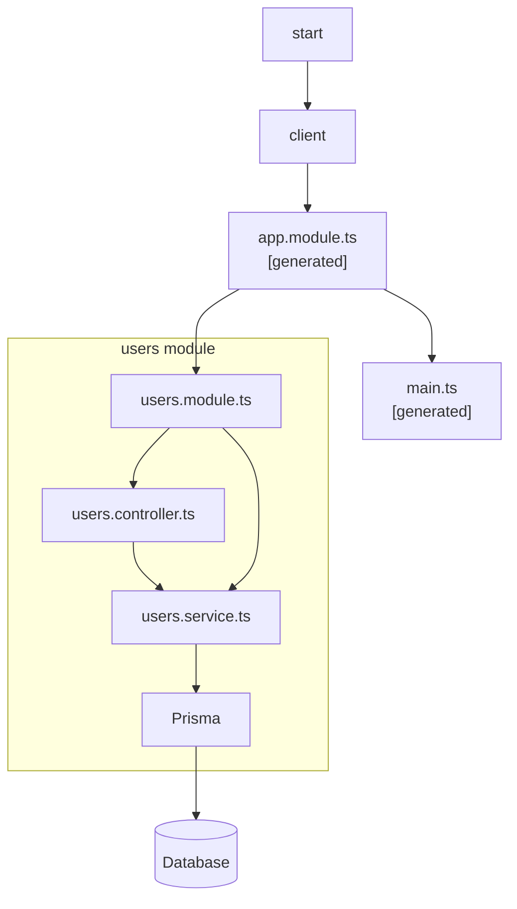

NestJS について。

https://nestjs.com/

Product の技術選定を行なっている。

今後の開発を見据えて、技術選定を行う。
わたしが考えている技術選定の前提条件は以下の通りである。
1. 少人数で適切なスピード感で開発できる。
1. メンバーの共通の技術スタックである。
1. (1)(2)を満たしつつ、アプリケーションの複雑さを将来に持ち込まない構成である。

現状の方針として考えられるのは
1. Framework を活用する。
    - ❓
2. 開発言語を最小限にする。
    - TypeScript
3. DDD と modular monolith pattern を採用する。

❓ の Framework について検討した。

今回の code はこちら。

https://github.com/danny-yamamoto/nestjs-sample.git

## About NestJS
- NestJS は Express をベースした Framework である。[^3]
- 今私が欲しい機能は、大体揃っている。
> ChatGPT
> NestJS は、Node.js のためのフル機能のサーバーサイドアプリケーションフレームワークです。Angular の開発者が使いやすいように設計されており、Angular のスタイルと構造にインスパイアされたものです。NestJS は、エクスプレスをベースにしており、エクスプレスのパワフルな機能を活用しながら、アプリケーションの構造化と保守性を向上させます。
> 
> NestJS の主な特徴や利点には以下が含まれます：
> 
> 1. **モジュールベースのアーキテクチャ**: アプリケーションをモジュールに分割し、それぞれのモジュールが独立して機能するように設計されています。これにより、アプリケーションが拡張可能でテストしやすくなります。
> 
> 2. **依存性注入 (DI)**: NestJS は、依存性注入を使ってコンポーネントやサービスを管理します。これにより、コードの再利用性とテスト容易性が向上し、コードの冗長性が減ります。
> 
> 3. **ミドルウェア**: NestJS は、エクスプレスのミドルウェアを簡単に統合できるため、リクエストとレスポンスの処理を柔軟に制御できます。
> 
> 4. **WebSocketsのサポート**: NestJS は、WebSocket のサポートも提供しており、リアルタイムな通信アプリケーションの開発が容易です。
> 
> 5. **スケーラビリティ**: NestJS は、標準的な Node.js のスケーラビリティ戦略に従っており、クラスタリング、ロードバランシング、マイクロサービスアーキテクチャなどの手法を使用して、アプリケーションのパフォーマンスを向上させることができます。
> 
> NestJS は、TypeScript で書かれており、静的型付け言語の恩恵を受けることができます。このため、開発プロセスがより安全で効率的になります。

## Architecture
- NestJS は module で構成できる。

https://github.com/danny-yamamoto/nestjs-sample/blob/main/src/app.module.ts

- API の雛形を generate してくれる。誰が実装しても構成を統一できることは大きなメリットだと思う。`nest g resource [name]`
- Domain logic は `xxx.service.ts` に実装する。

https://github.com/danny-yamamoto/nestjs-sample/blob/main/src/users/users.service.ts



```bash
node ➜ /workspaces/nestjs-sample (main) $ curl -i -X POST -H 'Content-Type: application/json' -d '{"name" : "田中" , "email" : "tanaka@example.com"}' localhost:3000/users
HTTP/1.1 201 Created
X-Powered-By: Express
Content-Type: application/json; charset=utf-8
Content-Length: 53
ETag: W/"35-ehdQQ2Af1o3GTjA+0ljhQJ2hy3A"
Date: Wed, 01 May 2024 09:53:24 GMT
Connection: keep-alive
Keep-Alive: timeout=5

{"id":6,"email":"tanaka@example.com","name":"田中"}
node ➜ /workspaces/nestjs-sample (main) $ 
```

## Schema definition
- NestJS は Web API を OpenAPI[^4] 形式で共有できる。[^1]
- NestJS は Swagger を提供している。GraphQL Playground も。[^2]
- IMO, API は開発した後が重要だと思う。なぜなら、どの会社でも「API の仕様を教えてください。」というやり取りを目にするから。
> The OpenAPI specification is a language-agnostic definition format used to describe RESTful APIs. Nest provides a dedicated module which allows generating such a specification by leveraging decorators.
>
> OpenAPI仕様は、RESTful API を記述するために使用される、言語にとらわれない定義フォーマットである。Nestは、デコレータを活用してこのような仕様を生成できる専用モジュールを提供している。


## BTW
新しい職場のオンボーディングや業務理解が落ち着いてきた

そして、気づけば GitHub の草が枯れ始めていた 🌱

事業ドメインへの理解（Why）を深めつつ、最適な課題解決の How を提供できるよう Engineer として学びを深めていきたい

[^1]: https://docs.nestjs.com/openapi/introduction
[^2]: https://docs.nestjs.com/graphql/quick-start
[^3]: https://docs.nestjs.com/
[^4]: https://www.openapis.org/
