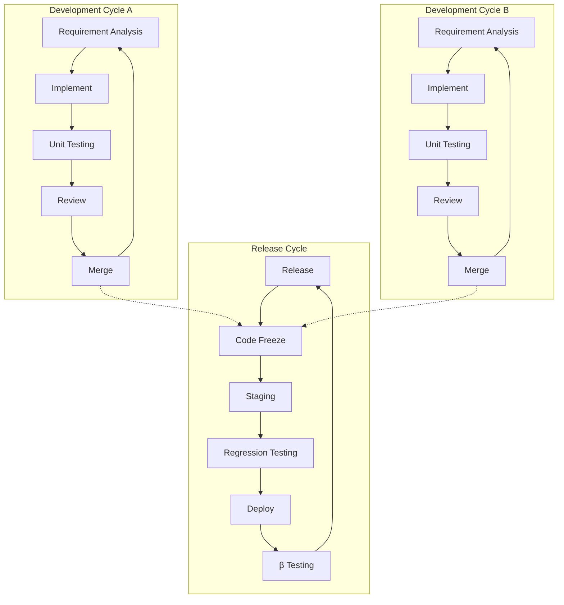

E2E Testing の自動化について。

https://www.shoeisha.co.jp/book/detail/9784798172354

こちらの本を読み、どうしたら継続的に自動テストを実践していけるのかについて学んでいる。



リグレッション テスト（リリース サイクル）で不具合を見つけた場合、手戻りが多く発生する。

不具合を「開発サイクル」の中で見つけることで開発者にとって手戻りが少なく効果的なテストにできる。

## tl;dr

- Application の実装に依存したテストを書かない。

## 振る舞いをテストする

- どちらも同じように動作する。しかし、前者は Application の内部構造に依存しており、実装方法を変更した場合に、副作用を受ける。
- 著書にも述べられている通り、内部構造をもとにテストを実装することは推奨されない。なぜなら、構造の変化により、Application と テスト コード両方の修正が必要になるから。

### Bad

- テスト コードを見てもどこをテストしているのか判断が難しい。


```typescript
    await page.locator('input[name="supplierName"]').fill('とほほ株式会社');
    await page
      .locator('select[name="billingMethod"]')
      .selectOption('クレジットカード');
    await expect(page.locator('input[name="name"]')).toHaveValue(customerName);
```

### Good

- `getByText` [^1] に変更する。
- 見え方が変わらなければテストは成功する。

```typescript
    await page.getByText(/取引先名/).fill('とほほ株式会社');
    await page.getByText(/^請求方法/).selectOption('クレジットカード');
    await expect(page.getByText(/法人名必須/)).toHaveValue(customerName);
```

## Conclusion

著書のあとがきで述べられていることが一番重要だと思う。

テスト自動化の前に必要なことは、周囲を巻き込むこと。そして、チームがテスト自動化から利益を得られる状態にすること。

当人がテスト自動化の効果や重要性について気付いても、それが利用されなければ、自動化したコード自体が陳腐化し、誰も使わない状態に陥る。

これは個人的にも何度も目にしてきた事象である。

自動テスト以外にも、IaC や CI/CD についても同じことが言えると思う。

今いる環境が DevOps に対する理解が乏しいと思えるのであれば、DevOps に対する理解がある場所を探す必要があると思う。

自分を変えることは出来るが、人を変えることは、費やす労力以上に難しいものであるから。

[^1]: https://playwright.dev/docs/api/class-page#page-get-by-text
