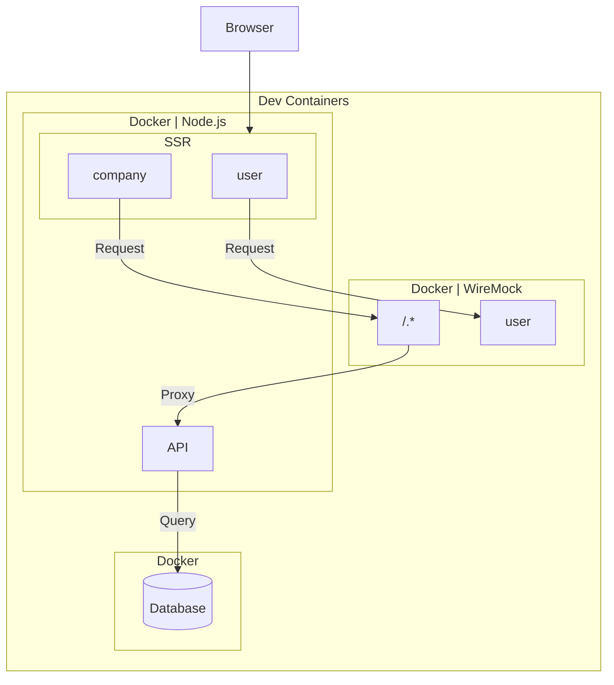

kubell Advent Calendar 2024 の投稿です。 [^1]

https://qiita.com/advent-calendar/2024/kubell

この投稿では、Schema 駆動開発と Mocking について書きます。

## tl;dr
- 外部 API への依存とスキーマ駆動開発における課題を解決するため、WireMock を導入
- WireMock を Dev Containers と Docker 環境に統合
- 開発 / QA 環境の一貫性
- Proxy モードの活用により、実 API と Mock の柔軟な切り替え

## 前提

### BPaaS サービスとは

- チャット経由で会計、労務、総務など様々なバックオフィス業務をアウトソースできる「Chatwork アシスタント」などのサービスです。
- 私たちは現在バックオフィス業務管理システムの構築を進めています。

https://assistant.chatwork.com/?adcode=orgic_platf_cwassistant_gm-om_corporate&utm_source=gm-om&utm_medium=corporate&utm_campaign=cwassistant&utm_term=non&utm_content=cid25

### スキルスタック

- 私たち BPaaS プロダクト開発チームの共通のスキルスタックは TypeScript です。Full-Satck TypeScript 開発を採用しました。

## 課題

プロジェクトを進める中で、開発効率とテストの信頼性に関する 2 つの重要な課題が浮かび上がりました。

### 外部API依存テストにおける信頼性向上

- 1つ目は、外部 API に依存したテストの脆弱性です。
- 一部の機能テストが外部 API の呼び出しを必要としています。外部 API の予期せぬ停止や変更によってテストが不安定になるリスクを抱えていました。

### スキーマ駆動開発におけるモック必要性

- 2つ目の課題は、スキーマ駆動開発に関するものでした。
- Schema 駆動開発を採用し、フロントエンドとバックエンドを並行して開発を進めています。API の実装が完了するまでの間、適切なモックが必須となっていました。
- 開発フローにおいて、この課題に対する効率的な解決策が必要でした。

## 解決策

- これらの課題を解決するため、私たちは WireMock の導入を決定しました。私自身の前職での WireMock 使用経験から、現在の課題に最適なツールだと思い提案しました。
- Dev Containers を使用している開発環境において、WireMock を Docker コンテナとして起動する構成を採用しました。
- 特に重要な点は、WireMock を Proxy として使用したことです。WireMock に定義されていない Requests は実際の API サーバーで処理されます。この構成は開発環境と QA 環境で統一しました。QA 環境では AWS ECS 上に Mock クラスターを構築しました。Endpoint を切り替えるだけで、一貫した開発・テスト環境を実現しています。
- 開発者が Mock の Response を容易に識別できるよう、Response の内容に明示的な Marker を含めました。

### 開発フロー

1. 開発チームで REST API の Schema を決定
1. Response の JSON ファイルを用意
1. 準備した JSON ファイルを WireMock の設定ディレクトリに配置
1. WireMock を Reset
1. 新しい Mock が利用可能になる

### Summary
- WireMock の導入により、テストの安定性が向上し、フロントエンドとバックエンドの並行開発がスムーズになりました。
- 外部 API への依存度を下げることで、より信頼性の高い開発・テストサイクルを実現することができました。

---

記事は以上です。

この投稿をみていただい方はいいねをお願いします。

それでは次回のアドカレでお会いしましょう👋

[^1]: 2024年7月1日、Chatwork株式会社は株式会社kubellへと社名変更しました。
