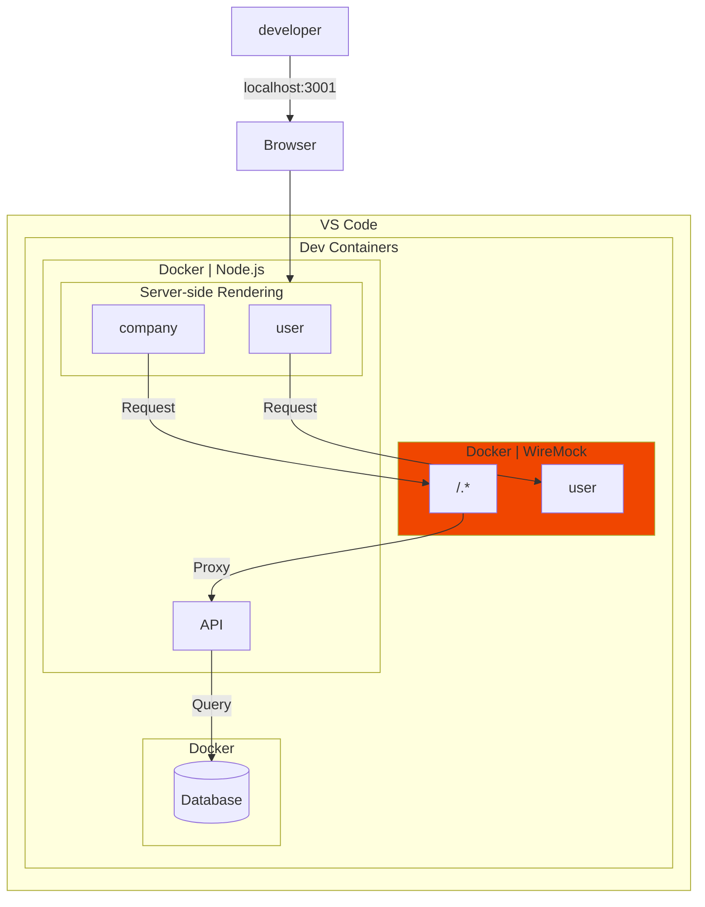
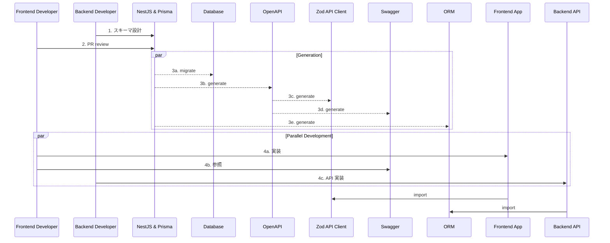

kubell Advent Calendar 2024 の投稿です。 [^1]

https://qiita.com/advent-calendar/2024/kubell

この投稿では、スキーマ駆動開発と Mocking について書きます。

## tl;dr

- 外部 API への依存とスキーマ駆動開発における課題を解決するため、WireMock [^2] を活用
- WireMock は、API モック テスト用の人気のオープン ソース ツール
- WireMock を Dev Containers と Docker 環境に統合
- 開発 / QA 環境の安定性と一貫性を確保
- WireMock の Proxy モードの活用により、実 API と Mock の柔軟な切り替えが可能

https://wiremock.org/



## 前提

### BPaaS サービス

- 私たちは BPaaS のバックオフィス業務管理システムの構築を進めています。早期の導入を目指しています。
- BPaaS は、チャット経由で会計、労務、総務など様々なバックオフィス業務をアウトソースできる「Chatwork アシスタント」などのサービスです。

https://assistant.chatwork.com/?adcode=orgic_platf_cwassistant_gm-om_corporate&utm_source=gm-om&utm_medium=corporate&utm_campaign=cwassistant&utm_term=non&utm_content=cid25

### スキーマ駆動開発

- データモデルや API の設計を最初に Schema として定義し、それを中心に開発を進めます。
- スキーマ駆動開発は、フロントエンドとバックエンドの開発を並行して効率的に開発を進めることができます。



## 課題

プロダクト開発を進める中で、開発効率とテストの信頼性に関する 2 つの課題がありました。

### 外部 API 依存テストにおける信頼性向上

- 1つ目は、外部 API に依存したテストの脆弱性です。
- 一部の機能テストが外部 API の呼び出しを必要としています。外部 API の予期せぬ停止や変更によってテストが不安定になるリスクを抱えていました。

### スキーマ駆動開発におけるモック必要性

- 2つ目の課題は、スキーマ駆動開発に関するものでした。
- 私たちはスキーマ駆動開発を採用しました。フロントエンドとバックエンドを並行して開発を進めています。Backend API の実装が完了するまでの間、適切なモックが必須となっていました。
- 開発フローにおいて、この課題に対する効率的な解決策が必要でした。

## 解決策

- これらの課題を解決するため、私たちは WireMock Standalone ( Running in Docker ) [^3] を活用しました。私自身の前職での WireMock 使用経験から、現在の課題に最適なツールだと思い提案しました。
- Dev Containers を使用している開発環境において、WireMock を Docker コンテナとして起動する構成を採用しました。

```bash
.
└── .devcontainer
    ├── devcontainer.env
    ├── devcontainer.json
    ├── docker-compose.yml
    ├── Dockerfile
    └── wiremock
        ├── __files
        │   └── user.json
        ├── mappings
        │   └── any.json
        └── README.md
```

```yml:docker-compose.yml
  wiremock:
    image: wiremock/wiremock:3.9.1
    volumes:
      - ./wiremock/__files:/home/wiremock/__files
      - ./wiremock/mappings:/home/wiremock/mappings
    entrypoint:
      [
        '/docker-entrypoint.sh',
        '--global-response-templating',
        '--disable-gzip',
        '--verbose',
      ]
```

- 特に重要な点は、WireMock を Proxy として使用したことです。WireMock に定義されていない Requests は実際の Backend API Server で処理されます。この構成は開発環境と QA 環境で統一しました。

> Proxying
> WireMock has the ability to selectively proxy requests through to other hosts. This supports a proxy/intercept setup where requests are by default proxied to another (possibly real, live) service, but where specific stubs are configured these are returned in place of the remote service’s response. Responses that the live service can’t be forced to generate on demand can thus be injected for testing. Proxying also supports record and playback.　[^4]

```json:any.json
{
  "priority": 99999,
  "request": {
    "urlPattern": "/.*"
  },
  "response": {
    "proxyBaseUrl": "http://localhost:3000"
  }
}
```

- QA 環境では AWS ECS 上に Mock クラスターを構築しました。Endpoint を切り替えるだけで、一貫した開発・テスト環境を実現しています。

```json
    "containerDefinitions": [
        {
            "name": "wiremock",
            "image": "wiremock/wiremock:3.9.1",
            "cpu": 0,
            "portMappings": [
                {
                    "containerPort": 8080,
                    "hostPort": 8080,
                    "protocol": "tcp"
                }
            ],
            "essential": true,
            "mountPoints": [],
            "volumesFrom": [],
            "readonlyRootFilesystem": true,
            "logConfiguration": {
                "logDriver": "awslogs",
                "options": {
                    "awslogs-group": "hoge",
                    "awslogs-region": "ap-northeast-1",
                    "awslogs-stream-prefix": "wiremock"
                }
            },
            "systemControls": []
        }
    ],
```

- 開発者が Mock の Response を容易に識別できるよう、Response の内容に明示的な Marker を含めました。

### 開発フロー

1. 開発チームで REST API の Schema を決定
1. Response の JSON ファイルを用意
1. 準備した JSON ファイルを WireMock の設定ディレクトリに配置
1. WireMock を Reset `curl -X POST http://localhost:8080/__admin/mappings/reset`
1. 新しい Mock が利用可能になる

### Summary

- WireMock の活用により、テストの安定性が向上し、フロントエンドとバックエンドの並行開発がスムーズになりました。
- 外部 API への依存度を下げることで、より信頼性の高い開発サイクルを実現することができました。

---

記事は以上です。

この投稿をみていただい方はいいねをお願いします。

それでは次回のアドカレでお会いしましょう👋


[^1]: 2024年7月1日、Chatwork株式会社は株式会社kubellへと社名変更しました。

[^2]: https://wiremock.org/docs/

[^3]: https://wiremock.org/docs/standalone/docker/

[^4]: https://wiremock.org/docs/proxying/
