kubell Advent Calendar 2024 の投稿です。 [^1]

https://qiita.com/advent-calendar/2024/kubell

この投稿では、スキーマ駆動開発と Mocking について書きます。

```mermaid
flowchart TD
    %% メインコンポーネント
    browser["🌐 Browser"]
    developer["👨‍💻 Developer"]

    %% VS Code環境のサブグラフ
    subgraph ide ["VS Code"]
        direction TB
        
        %% Dev Containersのサブグラフ
        subgraph devcon ["Dev Containers"]
            direction TB
            
            %% WireMockコンテナ
            subgraph docker_mock ["WireMock Container"]
                direction LR
                any["/.*"]
                users["Users API Mock"]
            end
            
            %% データベースコンテナ
            subgraph docker_db ["Database Container"]
                db[(Database)]
            end
            
            %% モノレポコンテナ
            subgraph docker_monorepo ["Node.js Container"]
                direction TB
                subgraph render ["🖥️ Server-side Rendering"]
                    user["User Service"]
                    company["Company Service"]
                end
                api["Backend API"]
            end
        end
    end

    %% フロー定義
    developer -->|"localhost:3001"| browser
    browser --> render
    user -->|"Request"| users
    company -->|"Request"| any
    any -->|"Proxy"| api
    api -->|"Query"| db

    %% スタイル定義
    classDef default fill:#f9f9f9,stroke:#333,stroke-width:1px
    classDef container fill:#e1f5fe,stroke:#01579b,stroke-width:2px
    classDef service fill:#e8f5e9,stroke:#2e7d32,stroke-width:2px
    classDef database fill:#fff3e0,stroke:#e65100,stroke-width:2px
    classDef mock fill:#fce4ec,stroke:#880e4f,stroke-width:2px
    
    %% スタイル適用
    class docker_mock,docker_db,docker_monorepo container
    class user,company,api service
    class db database
    class users,any mock
```



```bash
██     ██ ██ ██████  ███████ ███    ███  ██████   ██████ ██   ██ 
██     ██ ██ ██   ██ ██      ████  ████ ██    ██ ██      ██  ██  
██  █  ██ ██ ██████  █████   ██ ████ ██ ██    ██ ██      █████   
██ ███ ██ ██ ██   ██ ██      ██  ██  ██ ██    ██ ██      ██  ██  
 ███ ███  ██ ██   ██ ███████ ██      ██  ██████   ██████ ██   ██ 

----------------------------------------------------------------
|               Cloud: https://wiremock.io/cloud               |
|                                                              |
|               Slack: https://slack.wiremock.org              |
----------------------------------------------------------------
```

## tl;dr

- 外部 API への依存とスキーマ駆動開発における課題を解決するため、WireMock [^2] を活用
- WireMock は、API モック テスト用の人気の OSS
- WireMock を Dev Containers と Docker 環境に統合
- 開発 / QA 環境の安定性と一貫性を確保
- WireMock の Proxy モードの活用により、実 API と Mock の柔軟な切り替えが可能

https://wiremock.org/

## 前提

### BPaaS サービス

- BPaaS は、チャット経由で会計、労務、総務など様々なバックオフィス業務をアウトソースできる「Chatwork アシスタント」などのサービスです。
- 私たちは BPaaS のバックオフィス業務管理システムの構築を進めています。いち早くプロダクトを構築し、価値を提供することを目指しています。

https://assistant.chatwork.com/?adcode=orgic_platf_cwassistant_gm-om_corporate&utm_source=gm-om&utm_medium=corporate&utm_campaign=cwassistant&utm_term=non&utm_content=cid25

### REST を選択した背景

- REST vs. GraphQL vs. gRPC
- 開発の効率性を重視し、メンバーの経験が多い REST が現状は最適だと判断しました。

### スキーマ駆動開発

- データモデルや API の設計を最初に Schema として定義し、それを中心に開発を進めます。
- スキーマ駆動開発は、フロントエンドとバックエンドの開発を並行して効率的に開発を進めることができます。

```mermaid
sequenceDiagram
    autonumber
    participant FD as 👨‍💻 Frontend<br/>Developer
    participant BD as 👩‍💻 Backend<br/>Developer
    participant Ent as 🏗️ NestJS &<br/>Prisma
    participant DB as 💾 Database
    participant OA as 📘 OpenAPI
    participant CL as 🔄 Zod API<br/>Client
    participant SW as 📚 Swagger
    participant ORM as 🔌 ORM
    participant FA as 🖥️ Frontend<br/>App
    participant BA as ⚡ Backend<br/>API

    rect rgb(240, 248, 255)
        Note over BD,Ent: 設計
        BD->>+Ent: スキーマ設計
        FD->>Ent: PRレビュー
        deactivate Ent
    end

    rect rgb(255, 248, 240)
        Note over Ent,ORM: 自動生成
        par Generation Phase
            Ent-->>DB: マイグレーション
            Ent-->>OA: OpenAPI 生成
            OA-->>CL: クライアント生成
            OA-->>SW: Swagger 生成
            Ent-->>ORM: ORM 生成
        end
    end

    rect rgb(240, 255, 240)
        Note over FD,BA: 実装
        par Development Phase
            FD->>FA: フロントエンド実装
            FD->>SW: API 仕様参照
            BD->>BA: バックエンド実装
        end
        FA->>CL: インポート
        BA->>ORM: インポート
    end
```



## 課題と解決策

プロダクト開発を進める中で、開発効率とテストの信頼性に関する 2 つの課題がありました。

### 課題 1. 外部 API 依存テストにおける信頼性向上

####  課題

- 1つ目は、外部 API に依存したテストの脆弱性です。一部の機能テストが外部 API の呼び出しを必要としています。外部 API の予期せぬ停止や変更によってテストが不安定になるリスクを抱えていました。

#### 解決策

- 私たちは WireMock Standalone ( Running in Docker ) [^3] を活用しました。Dev Containers で、WireMock を Docker コンテナとして起動する構成を採用しました。
- これにより、`mappings` にある 外部 API ( `external-api.json` ) は、一定の動作を保証されます。

```bash
.
└── .devcontainer
    ├── devcontainer.env
    ├── devcontainer.json
    ├── docker-compose.yml
    ├── Dockerfile
    └── wiremock
        ├── __files
        │   └── user.json
        ├── mappings
        │   ├── external-api.json    # 外部 API
        │   └── any.json
        └── README.md
```

```yml:docker-compose.yml
  wiremock:
    image: wiremock/wiremock:3.9.1
    volumes:
      - ./wiremock/__files:/home/wiremock/__files
      - ./wiremock/mappings:/home/wiremock/mappings
    entrypoint:
      [
        '/docker-entrypoint.sh',
        '--global-response-templating',
        '--disable-gzip',
        '--verbose',
      ]
```

### 課題 2. スキーマ駆動開発におけるモック必要性

####  課題

- 2つ目の課題は、スキーマ駆動開発に関するものでした。
- 私たちは、フロントエンドとバックエンドを並行して開発を進めています。Backend API の実装が完了するまでの間、適切なモックが必須となっていました。開発フローにおいて、この課題に対する効率的な解決策が必要でした。

#### 解決策

- 外部 API の対策と同様に Mock を用意しました。
- 特に重要な点は、WireMock を Proxy として使用したことです。WireMock に定義されていない Requests は実際の Backend API Server で処理されます。API の実装が完了した後、Mock の定義を削除することで、実 API で処理されます。

> Proxying
> 
> WireMock has the ability to selectively proxy requests through to other hosts. This supports a proxy/intercept setup where requests are by default proxied to another (possibly real, live) service, but where specific stubs are configured these are returned in place of the remote service’s response. Responses that the live service can’t be forced to generate on demand can thus be injected for testing. Proxying also supports record and playback.　[^4]

```json:any.json
{
  "priority": 99999,
  "request": {
    "urlPattern": "/.*"
  },
  "response": {
    "proxyBaseUrl": "http://localhost:3000"
  }
}
```

- また、この構成は開発環境と QA 環境で統一しました。QA 環境では AWS ECS 上に Mock クラスターを構築しました。Endpoint を切り替えるだけで、一貫した開発・テスト環境を実現しています。

```json
    "containerDefinitions": [
        {
            "name": "wiremock",
            "image": "wiremock/wiremock:3.9.1",
            "cpu": 0,
            "portMappings": [
                {
                    "containerPort": 8080,
                    "hostPort": 8080,
                    "protocol": "tcp"
                }
            ],
            "essential": true,
            "mountPoints": [],
            "volumesFrom": [],
            "readonlyRootFilesystem": true,
            "logConfiguration": {
                "logDriver": "awslogs",
                "options": {
                    "awslogs-group": "hoge",
                    "awslogs-region": "ap-northeast-1",
                    "awslogs-stream-prefix": "wiremock"
                }
            },
            "systemControls": []
        }
    ],
```

- 開発者が Mock の Response を容易に識別できるよう、Response の内容に明示的な Marker を含めました。

## 開発フロー

1. 開発チームで REST API の Schema を決定
1. Response の JSON ファイルを用意
1. 準備した JSON ファイルを WireMock の設定ディレクトリに配置
1. WireMock を Reset `curl -X POST http://localhost:8080/__admin/mappings/reset`
1. 新しい Mock が利用可能になる

## Summary

- WireMock の活用により、テストの安定性が向上し、フロントエンドとバックエンドの並行開発がスムーズになりました。
- 外部 API への依存度を下げることで、より信頼性の高い開発サイクルを実現することができました。

---

記事は以上です。

この投稿をみていただい方はいいねをお願いします。

それでは次回のアドカレでお会いしましょう👋


[^1]: 2024年7月1日、Chatwork株式会社は株式会社kubellへと社名変更しました。

[^2]: https://wiremock.org/docs/

[^3]: https://wiremock.org/docs/standalone/docker/

[^4]: https://wiremock.org/docs/proxying/
