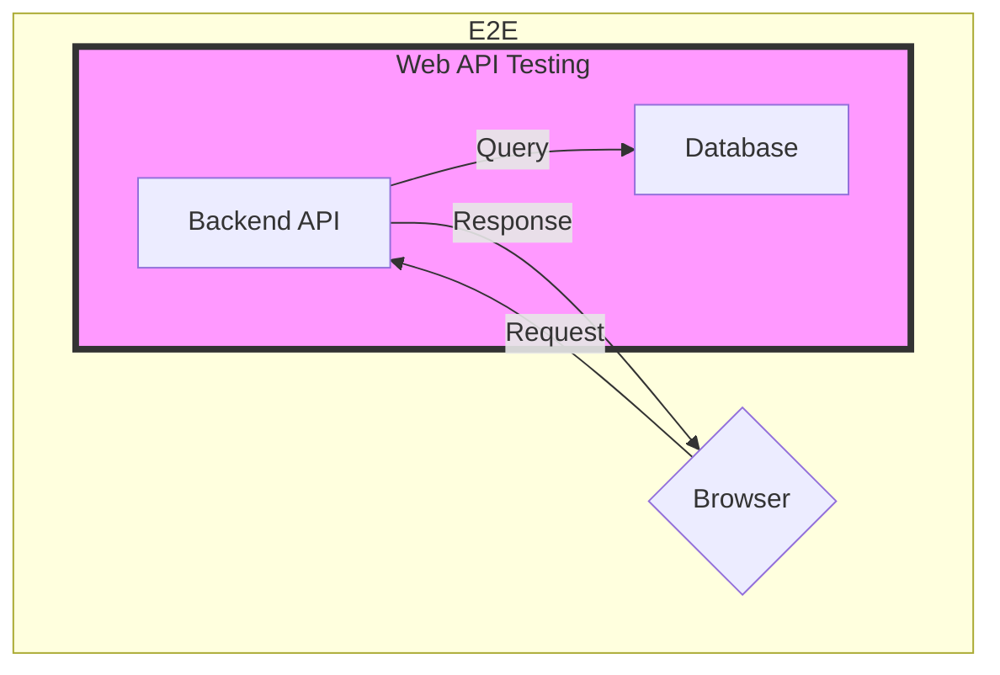

Playwright について。

https://playwright.dev/

開発中 Product では、 End-to-End Testing ( E2E ) [^6] で Playwright を使用する予定。

Product は、未開の地を進むため、柔軟に変更できる必要がある。

変更の度に E2E の Manual testing を繰り返していては、品質を保つことは難しい。

だから、テストの自動化 ( E2E ) が必要。 E2E は初期から想定していなければ、後から自動化することは難しい。

そして、 E2E とは別に Web API Testing も必要となる。 画面の描画に依存しない API 単体の動作を保証するため。



Web API Testing に Playwright を使用することで、全体の技術 Stack を統一することができると思う。

今回、Playwright で Web API Test を実装してみる。

## 前提

- 構成は Monorepo 。TypeScript で実装した Frontend と Backend を 1 つのリポジトリで管理。
- Monorepo は `npm workspaces` [^7] で管理。 `nx` [^1] や `Turborepo` [^2] を使用しないのは、 `Amplify Gen 2` [^3] との相性の問題。
- 環境は `VS Code` と `Dev Containers` 。
- Backend API は `NestJS` [^4] 。

## Installation

- `Dev Containers` でブラウザでのテストを実行する場合、 option の指定が必要。 `--ui-host=0.0.0.0`

```bash
# Create a workspace
npm init -w ./web-api-tests
cd web-api-tests
# Initialize Playwright
npm init playwright@latest
# Run tests
npx playwright test --ui-host=0.0.0.0
```

## Here we go!!

### Create a test code

- テストを追加する。

```TypeScript
import test, { expect } from "@playwright/test";

test('api', async ({request}) => {
    const result = await request.get('http://localhost:3000')
    expect(result.status()).toBe(200);
    expect(result.ok()).toBeTruthy()
    expect(await result.text()).toEqual('Hello World!')
})
```

- NestJS のハロワを GUI でテストする。


```bash
npx playwright test --ui-host=0.0.0.0
```

- Command line でもテスト可能。

```bash
root ➜ /workspaces/hogehoge/web-api-tests (main) $ npx playwright test

Running 9 tests using 6 workers
  9 passed (2.7s)

To open last HTML report run:

  npx playwright show-report

root ➜ /workspaces/hogehoge/web-api-tests (main) $ 
```

- 何も設定をせずにコンテナ上で GUI を起動しようとするとエラーが発生する。回避方法が存在する。 [^5]
    - 今回は `Xquartz` は使用しない。CI を考えているため、Host machine に依存した設定は避ける。

```bash
Running 2 tests using 1 worker
  1) [chromium] › example.spec.ts:3:5 › has title ──────────────────────────────────────────────────

    Error: browserType.connect: Target page, context or browser has been closed
    Browser logs:

    ╔════════════════════════════════════════════════════════════════════════════════════════════════╗
    ║ Looks like you launched a headed browser without having a XServer running.                     ║
    ║ Set either 'headless: true' or use 'xvfb-run <your-playwright-app>' before running Playwright. ║
    ║                                                                                                ║
    ║ <3 Playwright Team                                                                             ║
    ╚════════════════════════════════════════════════════════════════════════════════════════════════╝

  2) [chromium] › example.spec.ts:10:5 › get started link ──────────────────────────────────────────

    Error: browserType.connect: Target page, context or browser has been closed
    Browser logs:

    ╔════════════════════════════════════════════════════════════════════════════════════════════════╗
    ║ Looks like you launched a headed browser without having a XServer running.                     ║
    ║ Set either 'headless: true' or use 'xvfb-run <your-playwright-app>' before running Playwright. ║
    ║                                                                                                ║
    ║ <3 Playwright Team                                                                             ║
    ╚════════════════════════════════════════════════════════════════════════════════════════════════╝

  2 failed
    [chromium] › example.spec.ts:3:5 › has title ───────────────────────────────────────────────────
    [chromium] › example.spec.ts:10:5 › get started link ───────────────────────────────────────────
```

## Practice

### Test use options
- 共通の設定などをどうするか。例えば、 URL などの環境別の設定。
    - `use: {}` object を使用する。

```typescript: web-api-tests/playwright.config.ts
export default defineConfig({
    /**
     * 省略
    */
    use: {
        baseURL: 'http://localhost:3000/',  // here
    },
    /**
     * 省略
    */
});
```

```typescript: web-api-tests/tests/api.spec.ts
test('hoge', async ({ request, baseURL }) => {  // here
    /**
     * 省略
    */
});
```

今回はここまで。

## Conclusion
> 変わりゆく故の安定がある
> 生きてる間に生まれ変われ
> 迷わないことが恐れないことが間違わないことが強さではない

スピードを落とさず、チャレンジを繰り返し成功を掴み取る

「変わり続ける」と言う安定した状態を目指す

[^1]: https://nx.dev/
[^2]: https://turbo.build/repo
[^3]: https://docs.amplify.aws/
[^4]: https://nestjs.com/
[^5]: https://future-architect.github.io/articles/20230823a/
[^6]: https://circleci.com/ja/blog/what-is-end-to-end-testing/
[^7]: https://docs.npmjs.com/cli/v7/using-npm/workspaces
