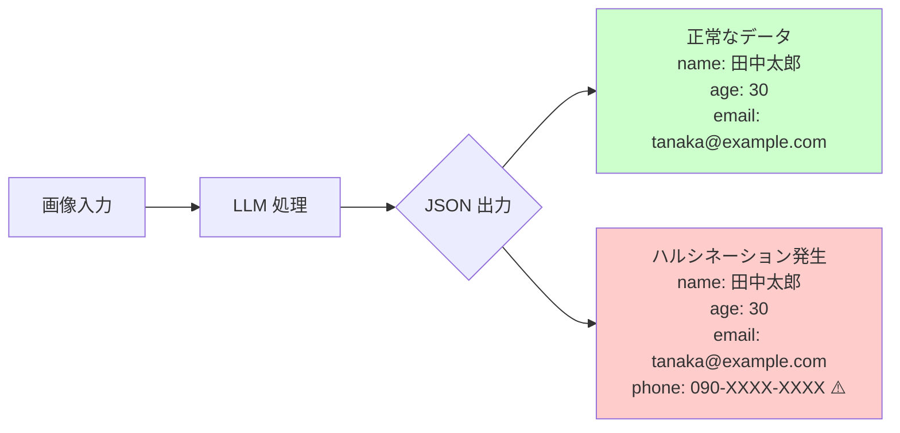
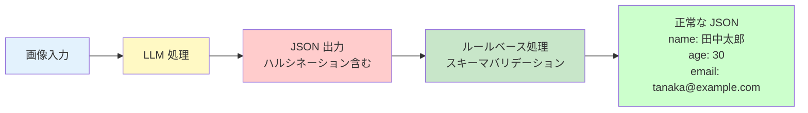

kubell Advent Calendar 2025 の投稿です。

[https://qiita.com/advent-calendar/2025/kubell:embed:cite]

プロダクト戦略ユニットの山本です。
今回は、AI エージェント開発におけるルールベースと LLM の効果的な使い分けについて考察します。

<!-- more -->

## TL;DR

AI エージェント開発では、ハルシネーション対策として「決定論」と「非決定論」の使い分けが重要です。例外的なケースはルールベースで処理し、HITL（Human in the Loop）は高精度モデルとアプリケーション側の制御で強制します。プロンプトだけに頼らず、ルールベースと LLM を適切に組み合わせることで、効率性と信頼性を両立できます。

[:contents]

## はじめに

AI エージェントを開発していると、ルールベースで実現すべきか、それとも LLM（大規模言語モデル）に任せるべきかという判断に直面します。
その代表的なテーマの 1 つが「ハルシネーション（幻覚）」への対策です。

ハルシネーションを回避しつつ、どのように LLM の良さを活かすべきか——これはある意味「とんち」に近い問題だと思います。
プロンプトの工夫だけでハルシネーションを抑え込もうとすると、プロンプトがどんどん膨れ上がり、最終的にはメンテナンスが難しいものになってしまいます。
では、どうすればよいのでしょうか。ここではいくつかの例を紹介します。

---

## 例1： 存在しないデータを勝手に埋める

これはハルシネーションでよく見られるパターンです。
特定の例外的なケースに対応しようとしても、完全に回避するのは難しいものです。
では、そのような場合にエージェント化を諦めるべきでしょうか？

上図のように、画像から構造化データを抽出する際、LLM が存在しないフィールド（例: `phone`）を勝手に推測して埋めてしまうケースがあります。

ここでの「とんち」は、**例外的なケースのみをルールベースで扱う**という選択です。
具体的には、読み取り処理の後に例外的な部分を切り落とすようにします。

このように、LLM による読み取り処理の後に、スキーマに存在しないフィールドをルールベースで削除する仕組みを導入します。
これにより、ルール化されたプロセスとして安定した動作を実現しつつ、LLM の良さも活かせるようになります。

---

## 例2 ：HITL（Human in the Loop）を無視する

これも LLM でよく起きる課題の 1 つです。
プロンプトをどれだけ工夫しても解決が難しい場合が多く、対応には 2 つの手段が必要になることがあります。
それは、**高精度なモデルを利用すること**と、**アプリケーション側で制御を強制すること**です。

モデルの精度を上げる方法としては、たとえば Gemini 2.0 から Gemini 2.5 へとアップデートすることで理解精度が大きく変わります。
これは誰もが想像しやすい、わかりやすい対処法です。

もう 1 つの「アプリケーションでの強制」は少し複雑です。
なぜなら、エージェントと UI の両方で対処が必要になるからです。
具体的には、**ツール呼び出し後に必ず承認を経るルートを設ける**ことが有効です。
こうすることで、エージェントが人間の確認を無視して勝手に処理を進めることを防止できます。

---

## まとめ：決定論と非決定論のバランスを取る

このような課題は他にもさまざまありますが、重要なのは「決定論」と「非決定論」の使い分けを意識することだと思います。
AI エージェントの導入を諦めるのではなく、**ユーザーに誠実に価値を届けるために、どこで人の知恵を使うべきかを見極めること**が大切です。

ソフトウェアエンジニアとして、効率性と信頼性の両立を目指し、「怠惰（よい意味での自動化志向）」を活かしていくことが、現状の AI エージェント開発のプラクティスではないでしょうか。

---

記事は以上です。

今後も AI エージェント開発に関する発信活動を継続予定です。BPaaS 戦略に興味をお持ちでしたら、ぜひお気軽にお問い合わせください。

この投稿をみていただい方はいいねをお願いします。

それでは次回のアドカレでお会いしましょう👋
