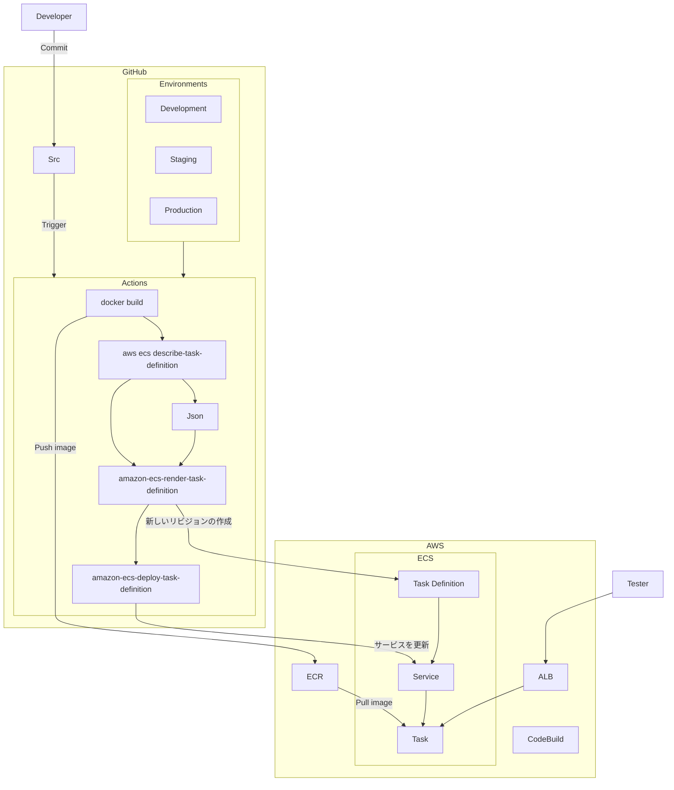

Code の修正を Trigger にした Amazon ECS ( ECS ) への Deploy について。

参考にしたのは、GitHub の公式。

https://docs.github.com/ja/actions/use-cases-and-examples/deploying/deploying-to-amazon-elastic-container-service#creating-the-workflow

構成は、こんな感じ



## Sum up

- k8s で ArgoCD などの GitOps で運用している場合、Helm chart の yaml を更新したら終わりのため、楽ではある。
- 一方、k8s や周辺の ecosystem の更新に追われることを考えると ECS の方が健康的に過ごせるよなというのは正直ある。


## 環境変数

- Self-hosted において、環境変数は、GitHub の `Environments` に設定する。CodeBuild の環境変数は使えない。
    - GitHub `Environments` は、2021年に登場した機能らしい。
    - 前職では、Cloud Build をメインで使用していた。Managed Service を優先的に使用した。
    - 理由は、Actions の容量を超えて、Build や Deploy が停止することが多発したため。


## Workflow

- 変更点。Json を出力して、最新のタスク定義を使い回す。

```yaml: .github/workflows/build-hoge-api.yml
      - name: Latest ECS task definition Json
        id: create-json
        run: aws ecs describe-task-definition --task-definition ${{ env.ECS_TASK_DEFINITION_ARN }} --query taskDefinition > taskdefinition.json

      - name: Fill in the new image ID in the Amazon ECS task definition
        id: task-def
        uses: aws-actions/amazon-ecs-render-task-definition@v1
        with:
          task-definition: taskdefinition.json
          container-name: api
          image: ${{ steps.build-image.outputs.image }}
```

## Conclusion

中学校の職場体験に在宅 programmer をお勧めしましたが、笑ってスルーされました

